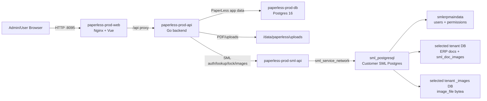

# Customer Deployment

## Target

- Customer URL: `http://45.122.49.250:8095`
- Stack path: `/data/paperless`
- Compose file: `/data/paperless/compose.yml`
- Production env file: `/data/paperless/config/.env.prod`
- Upload/PDF storage: `/data/paperless/uploads`
- Release evidence: `/data/paperless/releases/<timestamp>/`
- Preflight backup/snapshot: `/data/paperless/preflight-<timestamp>/`

The server has other projects. Keep PaperLess isolated and expose only the approved port.

The same release is also deployed for Wirat Home Mart at `http://43.240.113.44:8691`, using stack path `/data/paperless` and Compose project/container prefix `paperless-wirat`.

## Current Customer Status - 2026-07-20

- PaperLess Web release: `20260720112943` (`c3acecb`) on both customer installations
- PaperLess API release retained: `d13867f`; it was not restarted by this Web-only deployment
- SML API release retained: `a51c7e9`; it was not restarted by this deployment
- Shared SML tenant readiness registry is enabled independently in each PaperLess database
- Post-deploy evidence: `/data/paperless/releases/20260720112943/postdeploy-checks.txt` on each server

Latest smoke results:

- Both public URLs, `/health/live`, and `/health/ready` returned HTTP 200 after deployment.
- Both installations run the same Web image digest `sha256:1ea21b709330d22a0c80a87283e611c5a3f81f9ee602e05815ad2f7db95289f8` built by GitHub Actions for `linux/amd64`.
- PaperLess API and DB were healthy; existing DB and SML API container IDs/restart counts were unchanged on both servers.
- Browser smoke confirmed the database batch-check button on desktop and 390px mobile with no horizontal overflow or console errors.
- The additive `sml_tenant_readiness_registry` migration and feature flag were verified on both installations.
- On the Pui installation, STPT moved from `unverified` to `ready`; a second login returned `source=registry`, and selected-database login issued a valid session without another full schema check.
- All 27 databases visible to the test account received their first registry result with no fatal/panic log entries. Non-ready databases remain blocked with their stored SML issue until a user retries after SML repair.
- The previous local Web image `d13867f` remains available for rollback. No source archive or Docker build cache was created on either customer server.

Known tenant readiness note: `PTTP-TAX` was still missing its main tenant DB during the latest login smoke and must remain blocked until SML/admin database setup is complete.

## Port Policy

PaperLess customer deployment uses host port `8095` for the web container.

Do not expose the backend, PaperLess Postgres, or SML API containers directly to the host unless an explicit maintenance window requires it.

## Service Layout

| Service | Purpose | Host Exposure |
|---|---|---|
| `paperless-prod-web` | Nginx + built Vue app + `/api` proxy | `8095` |
| `paperless-prod-api` | Go PaperLess API | Docker network only |
| `paperless-prod-db` | PaperLess application Postgres | Docker network only |
| `paperless-prod-sml-api` | SML bridge for auth, lookup, lock, image upload | Docker network only |
| `sml_postgresql` | Customer SML Postgres, existing container | Existing SML network |

## Data Flow



## Environment

Production values belong in `/data/paperless/config/.env.prod` and must not be committed.

Required groups:

- PaperLess Postgres connection and storage paths
- `JWT_SECRET`
- SML API key shared between PaperLess backend and SML API service
- `SML_PAPERLESS_BASE_URL`
- `SML_AUTH_PROVIDER`
- `SML_AUTH_DATAGROUP`
- `SML_IMAGE_TEMPLATE_DATABASE` ต้องชี้ไปยัง `_images` database มาตรฐานของลูกค้ารายนั้น เช่น `vrh_images` ห้ามใช้ค่าจากลูกค้ารายอื่น
- `SML_PAPERLESS_TENANT` default tenant
- `PAPERLESS_LOCAL_AUTH_FALLBACK_ENABLED`
- `PUBLIC_BASE_URL`
- Upload and template limits
- `INTERNAL_DOCUMENTS_ENABLED=true` after the additive migration and backend/frontend smoke checks pass

Provider and data group are system configuration values. The login UI must not ask the user to enter them.

## SML Tenant Image DB Preflight

Every selectable SML tenant must have a matching image database. For example, tenant `stpt` requires:

- `stpt` for ERP document data
- `stpt_images` for image bytes

Both databases must contain `public.sml_doc_images` with the same schema. Tenants created directly in PostgreSQL can miss the `_images` database, which causes PaperLess auto-finalization to stop at `completed_image_failed`.

กำหนด `SML_IMAGE_TEMPLATE_DATABASE` ใน production env ให้ตรงกับลูกค้าก่อนเริ่ม SML API แล้ว run จาก container ก่อนให้ลูกค้าทดสอบ:

```bash
docker exec <sml-api-container> ./verify-sml-tenant --all-allowed --template <template_images_db>
```

If a tenant image DB is missing, create only that image DB with dry-run first, then apply after customer approval:

```bash
docker exec <sml-api-container> ./provision-sml-image-db --tenant <tenant> --template <template_images_db>
docker exec <sml-api-container> ./provision-sml-image-db --tenant <tenant> --template <template_images_db> --apply
docker exec <sml-api-container> ./verify-sml-tenant --tenant <tenant> --template <template_images_db>
```

หน้าเลือก database มีปุ่ม `ตรวจสอบอีกครั้ง` สำหรับอ่าน readiness ล่าสุดหลังผู้ดูแลแก้ config/schema แล้ว ปุ่มนี้ไม่แก้ schema และไม่สร้าง database; การ provision ยังต้องผ่านสถานะที่ระบบรองรับและ approval ตาม runbook นี้

ผลตรวจจะแสดงทุกปัญหาที่พบพร้อมฐานข้อมูลและผู้รับผิดชอบ: ฐานหลัก/`_images` หาย, เปิดฐานไม่ได้หรือสงสัยฐานเสีย, ตารางหาย, columns/sequence/constraints/indexes ไม่ตรง, timeout, หรือระบบ template/readiness ไม่พร้อม ข้อความสำหรับผู้ใช้ต้องไม่แสดง PostgreSQL error ภายใน และต้องไม่แสดง `พร้อมใช้งาน` จน full verification ผ่านจริง

For day-to-day use, PaperLess also supports self-service image DB setup from the login page. If SML reports that a selected database is missing `<tenant>_images` or the `public.sml_doc_images` table is absent, the user can click `ตั้งค่า image DB`; PaperLess verifies the same SML username/password/database permission again, then creates only the missing image database/table through `paperless-prod-sml-api`. Main DB missing or existing schema mismatch cases remain blocked and require admin review.

Do not insert or repair `sml_doc_images` rows by direct SQL during normal operation. Use the PaperLess “ส่งรูป SML อีกครั้ง” retry action so events and lock flow remain auditable.

## Login Verification

Customer login must be verified with real SML credentials from `smlerpmaindata`.

Expected login behavior:

1. User enters SML username/password.
2. PaperLess asks the SML API for allowed databases and quick tenant readiness.
3. User selects a database every login.
4. If only the image DB is missing, user can click `ตั้งค่า image DB`; after success the same database becomes selectable.
5. PaperLess runs a full tenant readiness check before issuing the JWT.
6. PaperLess creates a local user if it does not exist yet.
7. SML `superadmin` maps to PaperLess `superadmin`; other SML users map to PaperLess `admin`. PaperLess-local users remain `user`.

## SML Saved Signature Rollout

The saved-signature feature reads `erp_user.signature_1` from the tenant selected in the JWT session. Enable `SML_SIGNATURE_SYNC_ENABLED=true` only after deploying the SML API endpoints for signature metadata and binary retrieval. Deployment order is SML API, PaperLess backend migration, frontend, then feature flag.

After deployment, sign in as superadmin, select the target database, open `/admin/users`, and run `Sync จาก SML`. Verify the preview summary before confirming. Test with one internal signer first: select `ลายเซ็นที่บันทึกไว้`, review the lazily loaded image, sign a new document, and verify the current/final PDF. Existing completed documents must retain their original signature file/version.

If sync reports a missing or invalid signature, PaperLess preserves the previous saved signature and records a warning. Set `SML_SIGNATURE_SYNC_ENABLED=false` for immediate rollback to draw-only signing; no schema rollback is required.

## Internal Document Rollout

Internal documents require SML API `GET /api/v1/company-profile`, the PaperLess additive migration, and the matching frontend. Deploy in this order: SML API, PaperLess API, PaperLess Web. Keep `INTERNAL_DOCUMENTS_ENABLED=false` until all three services are healthy, then enable it and recreate only the PaperLess API/Web services.

After enabling the flag, verify that the selected tenant has exactly one usable row in `public.erp_company_profile`. Open `Master เอกสารภายใน` as superadmin and confirm the three seeded Masters are inactive. Configure the Workflow before activating a Master; internal signature/legal frames are placed later on each real Draft PDF, so an Active Template is not required. Do not guess customer signers or activate a production Master with a test Workflow.

Safe smoke checks before customer configuration:

1. The Master list contains `PAYREQ`, `ADV`, and `PREPAY` as inactive.
2. The internal document create route opens and contains no PDF upload step.
3. An inactive or incomplete Master cannot create a document and returns a readable configuration error.
4. Existing SML document create, image upload, and lock flows remain unchanged.

After customer Workflow/Template configuration, create one approved test document, open the generated PDF, edit it once to verify immutable revision behavior, arrange the signature/legal boxes, send it, and complete signing. Printing the latest revision is optional. Confirm logs contain no SML image or SML lock request for that internal document.

For immediate application rollback set `INTERNAL_DOCUMENTS_ENABLED=false` and restore the previous immutable API/Web image tags. Do not drop the additive tables or columns; existing internal records remain audit data and become visible again when the flag is re-enabled.

### Shared SML database readiness

Set `SML_TENANT_READINESS_REGISTRY_ENABLED=true` so each SML database receives one full schema verification per PaperLess installation. The result is tenant-wide and shared by all users who currently have SML permission for that database. PaperLess still authenticates the user and reloads database permissions from SML on every login.

`ready` results do not expire and are not checked by a periodic worker. A database is checked again only after a failed result is manually retried, a structural SML operation invalidates the stored result, or the application verification version changes. The migration is additive; set the flag to `false` to return to the previous live-check behavior without dropping the registry table.

For an operational recheck of a database that is already ready, a signed-in superadmin can call `POST /api/admin/sml/tenant-readiness/recheck`. The endpoint always uses the tenant in the current JWT session, applies the same advisory lock/cooldown as login checks, and records an audit event; it cannot be used to inspect an arbitrary tenant.

Development default credentials are not assumed to work on the customer server.

## Deploy Checklist

1. Confirm port `8095` is free or assigned to PaperLess.
2. Create/update `/data/paperless/config/.env.prod` with production secrets.
3. Pull or copy the release source/images.
4. Run `docker compose --env-file /data/paperless/config/.env.prod up -d`.
5. Confirm all PaperLess containers are healthy/running.
6. Open `http://45.122.49.250:8095`.
7. Test login with a real SML account.
8. Select the customer tenant database.
9. Run SML tenant image DB preflight for every allowed tenant.
10. Smoke test dashboard, workflow config, document search, PDF preview, signer queue, SML image upload, and SML lock.
11. If saved signatures are enabled, sync one known SML signature and verify explicit saved/drawn selection on a new internal task.

## Container Release Pipeline

PaperLess Web and API images are built by GitHub Actions, not on a developer computer or customer server.

- Web image: `ghcr.io/bosocmputer/paperless-web:<commit-sha>`
- API image: `ghcr.io/bosocmputer/paperless-api:<commit-sha>`
- Target platform: `linux/amd64`
- Release tags are immutable short Git commit SHAs. The `main` tag is informational and must not be used in production Compose.
- GitHub Actions must pass the frontend build or backend test suite before publishing its image.

Production deployment remains a controlled manual step. For each customer:

1. Save the current Compose file and container evidence under `/data/paperless/releases/<timestamp>/`.
2. Replace only the target service image with the immutable GHCR SHA tag.
3. Run `docker compose pull <service>`.
4. Run `docker compose up -d --no-deps <service>`.
5. Verify public URL, `/health/live`, `/health/ready`, container IDs, restart counts, and logs.
6. Keep the previous image and Compose snapshot for rollback.

Example for a Web-only release:

```bash
docker compose --env-file /data/paperless/config/.env.prod pull web
docker compose --env-file /data/paperless/config/.env.prod up -d --no-deps web
```

Do not run `docker build`, `docker system prune`, or a full-stack restart on customer servers. If a release fails, restore the saved Compose file and recreate only the affected service.

## Smoke Commands

From the customer server:

```bash
docker ps --filter "name=paperless-prod"
curl -fsS http://127.0.0.1:8095/
curl -fsS http://127.0.0.1:8095/health/live
curl -fsS http://127.0.0.1:8095/health/ready
```

Do not print secrets in terminal logs that will be copied into tickets or chat.

## Rollback

Keep each deploy timestamped under `/data/paperless/releases/<timestamp>/`.

Rollback should restore:

- Previous compose file
- Previous image tags
- Previous env file backup if changed
- PaperLess DB backup if a schema/data rollback is required
- Upload volume snapshot only if file storage changed incompatibly

Prefer image/compose rollback first. Only roll back database state when the release has written incompatible data and the business owner approves data loss/replay implications.

## Post-Deploy Evidence

Save a short deployment evidence file under `/data/paperless/releases/<timestamp>/postdeploy-checks.txt` with:

- Commit SHA or image tags
- Container names and status
- URL smoke result
- Login/database selection result
- One PDF preview result
- One SML auth/lookup result
- Any known limitation or customer credential blocker
