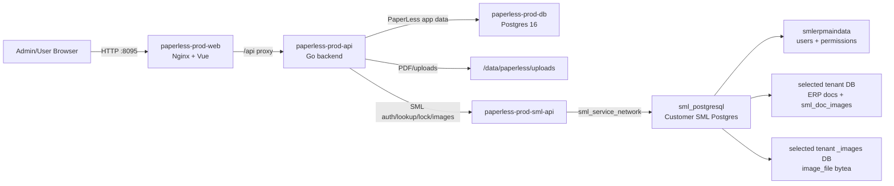

# Customer Deployment

## Target

- Customer URL: `http://45.122.49.250:8095`
- Stack path: `/data/paperless`
- Compose file: `/data/paperless/compose.yml`
- Production env file: `/data/paperless/config/.env.prod`
- Upload/PDF storage: `/data/paperless/uploads`
- Release evidence: `/data/paperless/releases/<timestamp>/`
- Preflight backup/snapshot: `/data/paperless/preflight-<timestamp>/`

The server has other projects. Keep PaperLess isolated and expose only the approved port.

## Port Policy

PaperLess customer deployment uses host port `8095` for the web container.

Do not expose the backend, PaperLess Postgres, or SML API containers directly to the host unless an explicit maintenance window requires it.

## Service Layout

| Service | Purpose | Host Exposure |
|---|---|---|
| `paperless-prod-web` | Nginx + built Vue app + `/api` proxy | `8095` |
| `paperless-prod-api` | Go PaperLess API | Docker network only |
| `paperless-prod-db` | PaperLess application Postgres | Docker network only |
| `paperless-prod-sml-api` | SML bridge for auth, lookup, lock, image upload | Docker network only |
| `sml_postgresql` | Customer SML Postgres, existing container | Existing SML network |

## Data Flow



## Environment

Production values belong in `/data/paperless/config/.env.prod` and must not be committed.

Required groups:

- PaperLess Postgres connection and storage paths
- `JWT_SECRET`
- SML API key shared between PaperLess backend and SML API service
- `SML_PAPERLESS_BASE_URL`
- `SML_AUTH_PROVIDER`
- `SML_AUTH_DATAGROUP`
- `SML_PAPERLESS_TENANT` default tenant
- `PAPERLESS_LOCAL_AUTH_FALLBACK_ENABLED`
- `PUBLIC_BASE_URL`
- Upload and template limits

Provider and data group are system configuration values. The login UI must not ask the user to enter them.

## Login Verification

Customer login must be verified with real SML credentials from `smlerpmaindata`.

Expected login behavior:

1. User enters SML username/password.
2. PaperLess asks the SML API for allowed databases.
3. User selects a database every login.
4. PaperLess creates a local user if it does not exist yet.
5. `superadmin` maps to admin role only when the real SML `superadmin` account authenticates successfully.

Development default credentials are not assumed to work on the customer server.

## Deploy Checklist

1. Confirm port `8095` is free or assigned to PaperLess.
2. Create/update `/data/paperless/config/.env.prod` with production secrets.
3. Pull or copy the release source/images.
4. Run `docker compose --env-file /data/paperless/config/.env.prod up -d`.
5. Confirm all PaperLess containers are healthy/running.
6. Open `http://45.122.49.250:8095`.
7. Test login with a real SML account.
8. Select the customer tenant database.
9. Smoke test dashboard, workflow config, document search, PDF preview, signer queue, SML image upload, and SML lock.

## Smoke Commands

From the customer server:

```bash
docker ps --filter "name=paperless-prod"
curl -fsS http://127.0.0.1:8095/
curl -fsS http://127.0.0.1:8095/api/live
curl -fsS http://127.0.0.1:8095/api/ready
```

Do not print secrets in terminal logs that will be copied into tickets or chat.

## Rollback

Keep each deploy timestamped under `/data/paperless/releases/<timestamp>/`.

Rollback should restore:

- Previous compose file
- Previous image tags
- Previous env file backup if changed
- PaperLess DB backup if a schema/data rollback is required
- Upload volume snapshot only if file storage changed incompatibly

Prefer image/compose rollback first. Only roll back database state when the release has written incompatible data and the business owner approves data loss/replay implications.

## Post-Deploy Evidence

Save a short deployment evidence file under `/data/paperless/releases/<timestamp>/postdeploy-checks.txt` with:

- Commit SHA or image tags
- Container names and status
- URL smoke result
- Login/database selection result
- One PDF preview result
- One SML auth/lookup result
- Any known limitation or customer credential blocker
