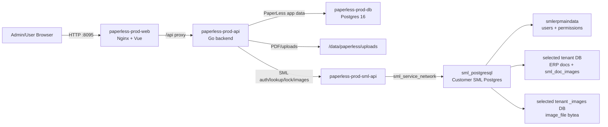

# Customer Deployment

## Target

- Customer URL: `http://45.122.49.250:8095`
- Stack path: `/data/paperless`
- Compose file: `/data/paperless/compose.yml`
- Production env file: `/data/paperless/config/.env.prod`
- Upload/PDF storage: `/data/paperless/uploads`
- Release evidence: `/data/paperless/releases/<timestamp>/`
- Preflight backup/snapshot: `/data/paperless/preflight-<timestamp>/`

The server has other projects. Keep PaperLess isolated and expose only the approved port.

## Current Customer Status - 2026-07-16

- PaperLess API/Web release: `20260716153839` (`fac91c7`)
- SML API hotfix release: `20260716155654` (`4232d27`)
- Status: deployed with SML saved-signature sync enabled; waiting for customer confirmation sync and signing test
- Post-deploy evidence: `/data/paperless/releases/20260716155654/postdeploy-checks.txt`

Latest smoke results:

- Web container was running; PaperLess API, SML API, and PaperLess DB containers were healthy.
- `http://45.122.49.250:8095/` and `http://45.122.49.250:8095/health/ready` returned HTTP 200.
- Login returned 27 SML databases and selected tenant `STPT` successfully.
- Saved-signature dry-run found one valid new signature for `superadmin`; no sync was applied during deployment QA.
- The protected SML binary endpoint returned the real JPEG (`9000x5284`) successfully without exposing it in list responses or logs.
- Browser smoke confirmed the Sync button and SML signature column on `/admin/users`, with no console errors.
- Build cache was removed after deployment; current and immediate previous service images remain for rollback.

Known tenant readiness note: `PTTP-TAX` was still missing its main tenant DB during the latest login smoke and must remain blocked until SML/admin database setup is complete.

## Port Policy

PaperLess customer deployment uses host port `8095` for the web container.

Do not expose the backend, PaperLess Postgres, or SML API containers directly to the host unless an explicit maintenance window requires it.

## Service Layout

| Service | Purpose | Host Exposure |
|---|---|---|
| `paperless-prod-web` | Nginx + built Vue app + `/api` proxy | `8095` |
| `paperless-prod-api` | Go PaperLess API | Docker network only |
| `paperless-prod-db` | PaperLess application Postgres | Docker network only |
| `paperless-prod-sml-api` | SML bridge for auth, lookup, lock, image upload | Docker network only |
| `sml_postgresql` | Customer SML Postgres, existing container | Existing SML network |

## Data Flow



## Environment

Production values belong in `/data/paperless/config/.env.prod` and must not be committed.

Required groups:

- PaperLess Postgres connection and storage paths
- `JWT_SECRET`
- SML API key shared between PaperLess backend and SML API service
- `SML_PAPERLESS_BASE_URL`
- `SML_AUTH_PROVIDER`
- `SML_AUTH_DATAGROUP`
- `SML_IMAGE_TEMPLATE_DATABASE` ต้องชี้ไปยัง `_images` database มาตรฐานของลูกค้ารายนั้น เช่น `vrh_images` ห้ามใช้ค่าจากลูกค้ารายอื่น
- `SML_PAPERLESS_TENANT` default tenant
- `PAPERLESS_LOCAL_AUTH_FALLBACK_ENABLED`
- `PUBLIC_BASE_URL`
- Upload and template limits

Provider and data group are system configuration values. The login UI must not ask the user to enter them.

## SML Tenant Image DB Preflight

Every selectable SML tenant must have a matching image database. For example, tenant `stpt` requires:

- `stpt` for ERP document data
- `stpt_images` for image bytes

Both databases must contain `public.sml_doc_images` with the same schema. Tenants created directly in PostgreSQL can miss the `_images` database, which causes PaperLess auto-finalization to stop at `completed_image_failed`.

กำหนด `SML_IMAGE_TEMPLATE_DATABASE` ใน production env ให้ตรงกับลูกค้าก่อนเริ่ม SML API แล้ว run จาก container ก่อนให้ลูกค้าทดสอบ:

```bash
docker exec <sml-api-container> ./verify-sml-tenant --all-allowed --template <template_images_db>
```

If a tenant image DB is missing, create only that image DB with dry-run first, then apply after customer approval:

```bash
docker exec <sml-api-container> ./provision-sml-image-db --tenant <tenant> --template <template_images_db>
docker exec <sml-api-container> ./provision-sml-image-db --tenant <tenant> --template <template_images_db> --apply
docker exec <sml-api-container> ./verify-sml-tenant --tenant <tenant> --template <template_images_db>
```

หน้าเลือก database มีปุ่ม `ตรวจสอบอีกครั้ง` สำหรับอ่าน readiness ล่าสุดหลังผู้ดูแลแก้ config/schema แล้ว ปุ่มนี้ไม่แก้ schema และไม่สร้าง database; การ provision ยังต้องผ่านสถานะที่ระบบรองรับและ approval ตาม runbook นี้

For day-to-day use, PaperLess also supports self-service image DB setup from the login page. If SML reports that a selected database is missing `<tenant>_images` or the `public.sml_doc_images` table is absent, the user can click `ตั้งค่า image DB`; PaperLess verifies the same SML username/password/database permission again, then creates only the missing image database/table through `paperless-prod-sml-api`. Main DB missing or existing schema mismatch cases remain blocked and require admin review.

Do not insert or repair `sml_doc_images` rows by direct SQL during normal operation. Use the PaperLess “ส่งรูป SML อีกครั้ง” retry action so events and lock flow remain auditable.

## Login Verification

Customer login must be verified with real SML credentials from `smlerpmaindata`.

Expected login behavior:

1. User enters SML username/password.
2. PaperLess asks the SML API for allowed databases and quick tenant readiness.
3. User selects a database every login.
4. If only the image DB is missing, user can click `ตั้งค่า image DB`; after success the same database becomes selectable.
5. PaperLess runs a full tenant readiness check before issuing the JWT.
6. PaperLess creates a local user if it does not exist yet.
7. SML `superadmin` maps to PaperLess `superadmin`; other SML users map to PaperLess `admin`. PaperLess-local users remain `user`.

## SML Saved Signature Rollout

The saved-signature feature reads `erp_user.signature_1` from the tenant selected in the JWT session. Enable `SML_SIGNATURE_SYNC_ENABLED=true` only after deploying the SML API endpoints for signature metadata and binary retrieval. Deployment order is SML API, PaperLess backend migration, frontend, then feature flag.

After deployment, sign in as superadmin, select the target database, open `/admin/users`, and run `Sync จาก SML`. Verify the preview summary before confirming. Test with one internal signer first: select `ลายเซ็นที่บันทึกไว้`, review the lazily loaded image, sign a new document, and verify the current/final PDF. Existing completed documents must retain their original signature file/version.

If sync reports a missing or invalid signature, PaperLess preserves the previous saved signature and records a warning. Set `SML_SIGNATURE_SYNC_ENABLED=false` for immediate rollback to draw-only signing; no schema rollback is required.

Development default credentials are not assumed to work on the customer server.

## Deploy Checklist

1. Confirm port `8095` is free or assigned to PaperLess.
2. Create/update `/data/paperless/config/.env.prod` with production secrets.
3. Pull or copy the release source/images.
4. Run `docker compose --env-file /data/paperless/config/.env.prod up -d`.
5. Confirm all PaperLess containers are healthy/running.
6. Open `http://45.122.49.250:8095`.
7. Test login with a real SML account.
8. Select the customer tenant database.
9. Run SML tenant image DB preflight for every allowed tenant.
10. Smoke test dashboard, workflow config, document search, PDF preview, signer queue, SML image upload, and SML lock.
11. If saved signatures are enabled, sync one known SML signature and verify explicit saved/drawn selection on a new internal task.

## Smoke Commands

From the customer server:

```bash
docker ps --filter "name=paperless-prod"
curl -fsS http://127.0.0.1:8095/
curl -fsS http://127.0.0.1:8095/health/live
curl -fsS http://127.0.0.1:8095/health/ready
```

Do not print secrets in terminal logs that will be copied into tickets or chat.

## Rollback

Keep each deploy timestamped under `/data/paperless/releases/<timestamp>/`.

Rollback should restore:

- Previous compose file
- Previous image tags
- Previous env file backup if changed
- PaperLess DB backup if a schema/data rollback is required
- Upload volume snapshot only if file storage changed incompatibly

Prefer image/compose rollback first. Only roll back database state when the release has written incompatible data and the business owner approves data loss/replay implications.

## Post-Deploy Evidence

Save a short deployment evidence file under `/data/paperless/releases/<timestamp>/postdeploy-checks.txt` with:

- Commit SHA or image tags
- Container names and status
- URL smoke result
- Login/database selection result
- One PDF preview result
- One SML auth/lookup result
- Any known limitation or customer credential blocker
