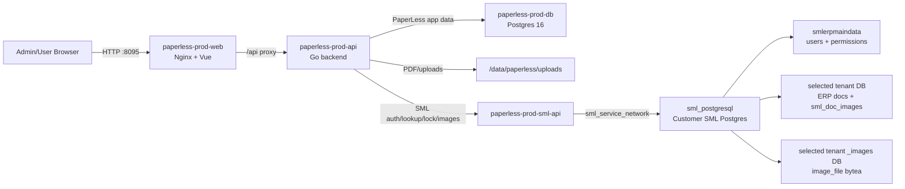

# Customer Deployment

## Target

- Customer URL: `http://45.122.49.250:8095`
- Stack path: `/data/paperless`
- Compose file: `/data/paperless/compose.yml`
- Production env file: `/data/paperless/config/.env.prod`
- Upload/PDF storage: `/data/paperless/uploads`
- Release evidence: `/data/paperless/releases/<timestamp>/`
- Preflight backup/snapshot: `/data/paperless/preflight-<timestamp>/`

The server has other projects. Keep PaperLess isolated and expose only the approved port.

The same release is also deployed for Wirat Home Mart at `http://43.240.113.44:8691`, using stack path `/data/paperless` and Compose project/container prefix `paperless-wirat`.

The same release is also deployed for Insee Construction at `http://45.122.49.253:8095`, using stack path `/data/paperless` and Compose project/container prefix `paperless-insee`.

The same release is also deployed for Damrong Homeplus at `http://45.122.49.252:8095`, using stack path `/data/paperless` and Compose project/container prefix `paperless-damrong`. This server hosts multiple unrelated customer projects (traefik, smlmcp, pickandpack, tms, accountupdater, pgadmin4) alongside a shared `sml_postgresql` instance serving many unrelated SML tenants; PaperLess containers and network are fully isolated under the `paperless-damrong-*` prefix and only port `8095` is published.

A fifth deployment, Amata, shares the same physical server as Insee Construction (`45.122.49.253`) rather than a new server. It runs as a fully separate stack — its own stack path `/data/paperless-amata`, Compose project `paperless-amata`, own `db`/`api`/`web`/`sml-api` containers and own Docker network — published on a different host port `9096` (Insee keeps `8095` unchanged on the same host). The two stacks only share the pre-existing `sml_postgresql` container (the customer's central SML ERP Postgres, connected via the external `sml_service_network`), same as how Damrong's PaperLess containers share that server's unrelated projects without touching them.

## Current Customer Status - 2026-08-26 (all five shops, api only): document_scope=own was blocking a user's own drafts and all document actions

Customer report (Damrong Homeplus, user `01020`): after importing PDFs via "นำเข้าหลายไฟล์", the request errored with the duplicate-conflict message ("เอกสารนี้มีอยู่ใน PaperLess แล้วและอยู่ระหว่างเตรียมส่ง"), yet the pending-document count visibly went up, and neither "เอกสารเตรียมส่ง" nor "ประวัติเอกสาร" (checked as superadmin too) showed the document at all.

Root cause confirmed directly against Damrong's production database: `GET /api/signing-documents` is one shared endpoint for all three queues (draft/active/history), distinguished only by a `?queue=` query parameter the route middleware has no visibility into at registration time. The route had been gated with `requireMenuPermission("signing-documents", true)` (from the menu-permission feature two days earlier), applying the `document_scope=own` restriction uniformly to every queue - but that restriction was only ever intended to gate "browse all company documents" (active/history), never a user's own drafts, which were never "someone else's document" to begin with. This shop's own superadmin had already set `01020`'s `document_scope` to `own` (the feature working as designed elsewhere), and every queue silently `403`'d as a result, including their own drafts - the document itself was never lost: confirmed still present in `signing_documents` with `status='draft'`, `created_by=01020`, exactly matching the two reported doc numbers (`2RIO2608-00038`, `2OF2608-00001`).

**Fixed in `paperless-api:445faed`** (was `da1d6be`): moved the scope check out of the route middleware (which cannot distinguish queues) into `listSigningDocuments` itself, where `?queue=` is known - `document_scope=own` now applies only when `queue != "draft"`. Also removed the scope check entirely from every document detail/action route (`{id}`, related-documents, reference-check, attachments, send, confirm, cancel, retry-final-pdf, retry-sml-images, retry-sml-lock, print-copies, external-token/regenerate) per explicit customer decision: opening, finishing, or acting on a document a user already has menu access to should never be blocked by this toggle - it now exclusively gates the "all documents" browse list. Verified directly against the real affected account before deploying: logged in as `01020` against Damrong, confirmed `GET /api/signing-documents?queue=draft` now returns both previously-invisible documents (`200`, was `403`), confirmed `queue=active`/`queue=history` correctly still return `403` (the intended restriction is otherwise unchanged), and confirmed the document's detail/attachments endpoints now open (`200`).

This is an `api`-only change - `paperless-web`/`sml-api-bybos`/`db` untouched, so only `api` was redeployed on each shop.

- **Damrong Homeplus**: deployed first (the affected shop), verified live against the real `01020` account and the real stuck documents as described above before rolling out further. Release evidence `/data/paperless/releases/20260826133711-fix-document-scope-drafts-445faed/postdeploy-checks.txt`.
- **Pui, Wirat Home Mart, Insee Construction, Amata**: deployed same-session once the Damrong fix was confirmed working - all five shops carry the same menu-permission code, so any shop where a superadmin sets `document_scope=own` for someone would hit the identical bug. Healthy on each, public URL smoke HTTP 200. Release evidence:
  - Pui: `/data/paperless/releases/20260826133901-fix-document-scope-drafts-445faed/postdeploy-checks.txt`
  - Wirat Home Mart: `/data/paperless/releases/20260826133934-fix-document-scope-drafts-445faed/postdeploy-checks.txt`
  - Insee Construction: `/data/paperless/releases/20260826134012-fix-document-scope-drafts-445faed/postdeploy-checks.txt`
  - Amata: `/data/paperless-amata/releases/20260826134034-fix-document-scope-drafts-445faed/postdeploy-checks.txt`

Customer to retest: user `01020` (or any account with `document_scope=own`) should now see their own drafts and be able to open/finish preparing them normally; re-attempt importing `2RIO2608-00038`/`2OF2608-00001` if still needed, or confirm the existing draft rows are now visible and usable as-is.

## Current Customer Status - 2026-08-26 (all five shops, web only): "ประวัติเอกสาร" sidebar item and direct-URL navigation now respect document_scope=own

Follow-up from the `445faed` fix above: after fixing the API so `document_scope=own` correctly stopped blocking a user's own drafts, the customer reported that navigating directly to `/signing/documents/history` on Damrong still returned `403 document_scope_own_only` for user `01020`, and asked whether the user should even be able to see the "ประวัติเอกสาร" menu at all given their current config.

Root cause: `AppMenu.vue`'s "ประวัติเอกสาร" sidebar item was missing the `authStore.canSeeAllDocuments()` gate that its sibling "เอกสารรอเซ็น" item already had from the original menu-permission rollout - so a `document_scope=own` user still saw a clickable "ประวัติเอกสาร" link that would immediately 403 on click. `router/index.js`'s post-navigation redirect guard had the same asymmetry: it checked the `signing-documents` route name but not `signing-document-history`, so typing the history URL directly also wasn't redirected. This surfaced a real config finding along the way: 86 of Damrong's admin accounts have `document_scope='own'` set simultaneously (identical `updated_at` second and `updated_by`), consistent with the standard "select-all column header + bulk save" feature working as designed - left as-is, not reverted, per the customer's own confirmation that this reflects their intended config.

**Fixed in `paperless-web:224a0bb`** (was `c3fd1df`): added the missing `&& authStore.canSeeAllDocuments()` condition to the "ประวัติเอกสาร" sidebar item in `AppMenu.vue`, matching the existing "เอกสารรอเซ็น" pattern exactly; extended the router guard's route-name check to include `signing-document-history` alongside `signing-documents`. This is a `web`-only change - no backend behavior changed, only what the UI shows/redirects, consistent with the `document_scope` restriction already being correctly enforced server-side since the `445faed` fix.

This is a `web`-only change - `api`/`sml-api-bybos`/`db` untouched, so only `web` was redeployed on each shop.

- **Damrong Homeplus**: deployed first (the affected shop), public URL smoke HTTP 200. Release evidence `/data/paperless/releases/20260826134935-fix-history-menu-scope-224a0bb/postdeploy-checks.txt`.
- **Pui, Wirat Home Mart, Insee Construction, Amata**: deployed same-session - all five shops carry the same menu-permission code, so any shop where a superadmin sets `document_scope=own` for someone would show the same inconsistent sidebar/redirect behavior. Healthy on each, public URL smoke HTTP 200. Release evidence:
  - Pui: `/data/paperless/releases/20260826135355-fix-history-menu-scope-224a0bb/postdeploy-checks.txt`
  - Wirat Home Mart: `/data/paperless/releases/20260826135422-fix-history-menu-scope-224a0bb/postdeploy-checks.txt`
  - Insee Construction: `/data/paperless/releases/20260826135453-fix-history-menu-scope-224a0bb/postdeploy-checks.txt`
  - Amata: `/data/paperless-amata/releases/20260826135523-fix-history-menu-scope-224a0bb/postdeploy-checks.txt`

Customer to retest: user `01020` (and any other `document_scope=own` account) should no longer see "ประวัติเอกสาร" in the sidebar, and direct navigation to `/signing/documents/history` should redirect to their own "ประวัติการเซ็นของฉัน" screen instead of showing a 403.

## Current Customer Status - 2026-08-24 (all five shops, api+web): per-user menu permission overlay

New superadmin-only screen (`/admin/users/menu-permissions`) letting a superadmin grant/revoke, per individual admin/user account: which menu screens they can open, and whether they see all signing documents or only ones where they are the signer. Additive overlay on the existing 3-role system (superadmin/admin/user) - `requireAuth`/`requireAdmin`/`requireSuperAdmin` middleware and every existing route's role gate are unchanged; superadmin is always fully unrestricted. New `user_menu_permissions` table (one row per user, `TEXT[]` of granted menu keys + `document_scope` enum), enforced by a new `requireMenuPermission` middleware wrapping `requireAdmin`, wired onto the `signing-documents`/`signing-document-drafts`/`internal-document-create` route families.

**Default-permissive by design and by necessity**: absence of a permission row for a user means unrestricted, identical to today's behavior - never "sees nothing." All 18 real admin/user accounts across the 5 shops kept working exactly as before through this rollout; nothing changes for anyone until a superadmin explicitly visits the new screen and narrows a specific person. Confirmed a superadmin must configure each shop's database separately - `user_menu_permissions` lives per-shop like every other table, and each shop has its own distinct set of admin/user accounts, so there is no cross-shop propagation of a permission change.

**Testing before rollout was unusually thorough for a security-boundary feature** - live end-to-end verification against Pui's real production instance using temporary local test accounts (created directly in the DB, deactivated rather than hard-deleted afterward to preserve audit-log referential integrity, never touching any real customer credential):
- Backend enforcement genuinely blocks, not just hides in the UI: revoking a menu key made the corresponding API call return `403 menu_permission_denied`; setting `document_scope=own` made the admin document-list API return `403 document_scope_own_only` while the admin's own task/history queue kept returning `200` normally.
- Optimistic concurrency verified with two simultaneous real browser sessions editing the same user: the first save succeeds, the second (now-stale) save is rejected with a clear "someone else already saved" toast and the row reloads to the true persisted state - confirmed in the database that the losing edit never silently overwrote the winning one.
- UI iterated three times based on direct customer feedback after the first deploy: replaced an initial per-row "select all" checkbox with the standard column-header tri-state select-all pattern; replaced per-row save buttons with a single "บันทึกทั้งหมด" bulk-save action (with an unsaved-changes navigation guard, since a bulk-deferred save can now accumulate edits across many users before persisting); made the table header sticky vertically (was only sticky horizontally, losing the menu-column labels when scrolling past a screenful of users) and made the table fill the remaining viewport height instead of a fixed cap that left unused whitespace on tall displays.

This is an `api`+`web` change - `sml-api-bybos`/`db` untouched, so only `api` and `web` were redeployed on each shop. Note the two images carry **different tags** on this release: only the initial commit (`da1d6be`) touched backend code, so `paperless-api` stayed pinned at `da1d6be` while `paperless-web` advanced through several frontend-only follow-up commits to `c3fd1df` (the final UI-iteration state) - CI only rebuilds an image when its own service's files changed, so the two tags diverging here is expected, not a mismatch.

- **Pui**: first shop, deployed and iterated live across all UI-feedback rounds (`da1d6be` → `cb9a089` → `516ce40` → `137fcfa` → `1e92f8c` → `c3fd1df`), each round smoke-tested and several rounds verified end-to-end with real browser sessions as described above.
- **Wirat Home Mart, Insee Construction, Amata, Damrong Homeplus**: deployed same-session once Pui's UI iteration settled and the customer confirmed ready to roll out - `api:da1d6be` + `web:c3fd1df` on all four, healthy, public URL smoke HTTP 200, `/health/ready` HTTP 200, `user_menu_permissions` table confirmed present in each shop's database after deploy. Release evidence:
  - Wirat Home Mart: `/data/paperless/releases/20260824111952-menu-permissions-c3fd1df/postdeploy-checks.txt`
  - Insee Construction: `/data/paperless/releases/20260824112118-menu-permissions-da1d6be-c3fd1df/postdeploy-checks.txt`
  - Amata: `/data/paperless-amata/releases/20260824112155-menu-permissions-da1d6be-c3fd1df/postdeploy-checks.txt`
  - Damrong Homeplus: `/data/paperless/releases/20260824112253-menu-permissions-da1d6be-c3fd1df/postdeploy-checks.txt`

**Not yet done on any shop**: no superadmin has actually narrowed anyone yet on any of the five shops - the system is live but every account remains at its default-permissive (unconfigured) state everywhere. Per-shop rollout of actual restrictions is a separate, later action for whichever shop's superadmin chooses to use the new screen; each shop's `user_menu_permissions` table must be configured independently since permissions do not propagate across shops.

## Deploy pitfall: `uploads` bind-mount must be chowned to the container's runtime uid/gid

When creating a *new* shop's stack directory from scratch (not copying an existing one), `mkdir -p .../uploads` alone is not enough - the directory is owned by whatever uid/gid the SSH/sudo session used, but the `api` container's process runs as a fixed non-root user (`uid=100 gid=101`, `app:app`) inside the image. If the host directory's owner/permissions don't allow that uid/gid to write, every PDF upload fails at the `os.WriteFile` step with `permission denied` - after already passing content-type and PDF-readability validation, so the user-facing error is the generic `"Cannot save uploaded PDF right now."` (`upload_write_failed`/`upload_record_failed` in `signature_templates.go`, or `upload_store_failed` in `signing_documents.go`), not a PDF-content error. This affects every upload consistently, not intermittently, and can go unnoticed until a real user actually tries to upload.

Before declaring a new shop's initial deploy done, verify (and fix if needed):

```bash
docker exec <shop>-api id                                    # confirms uid=100 gid=101 app:app
stat -c "%u:%g %a %n" /data/<shop-path>/uploads               # must be 100:101, mode 770 (or otherwise writable by that uid/gid)
chown 100:101 /data/<shop-path>/uploads && chmod 770 /data/<shop-path>/uploads   # if not
docker exec <shop>-api sh -c 'echo test > /app/uploads/permcheck.tmp && echo WRITE_OK && rm /app/uploads/permcheck.tmp'  # live confirm, no restart needed - bind mount permission checks aren't cached
```

Discovered on Amata (`45.122.49.253:9096`) 2026-08-19: `/data/paperless-amata/uploads` was `1000:1000 755` (leftover from the `mkdir` step during initial setup, never chowned to match the container), vs. Insee's working `/data/paperless/uploads` at `100:101 770`. Fixed live via `chown`/`chmod`, confirmed with a real write test - no code change, no redeploy needed. `config/` differs in ownership too (`0:0 750` on Insee vs `1000:1000 755` on Amata) but is only read at container startup via `--env-file` by the host-side `docker compose` process, not written to by the running app, so it does not need the same fix.

## Current Customer Status - 2026-08-19 (Amata only, infra fix, no code deploy): PDF upload failed with "Cannot save uploaded PDF right now."

Customer (Amata) reported: uploading a PDF while configuring the initial signature-box frame for a PO document type (`signature-template` designer, "กำหนดกรอบเริ่มต้น") failed every time with `"Cannot save uploaded PDF right now."` - a different error from the earlier `"must be a readable PDF"` reports, which was the first signal this was not the same bug class.

Root cause confirmed directly from `paperless-amata-api` container logs, not guessed: every failed upload logged `write uploaded pdf failed ... permission denied` writing to `/app/uploads/<file>.pdf` - i.e. the file had already passed content-type and PDF-readability validation and failed purely at the disk-write step. See the "Deploy pitfall" section above for the full root cause: `/data/paperless-amata/uploads` was owned `1000:1000` (mode `755`) on the host instead of `100:101` (mode `770`) matching the `api` container's runtime user, a gap from this shop's initial setup the day before that had gone unnoticed until a real upload was attempted.

**Fixed live, no code change or redeploy**: `chown 100:101 /data/paperless-amata/uploads && chmod 770 /data/paperless-amata/uploads`, confirmed immediately with a real write test executed inside the running container (`docker exec paperless-amata-api sh -c 'echo test > /app/uploads/permcheck.tmp && ...'` - succeeded) - bind-mount permission checks are not cached, so no container restart was needed.

Customer to retest: re-attempt the PO signature-template PDF upload on Amata and confirm it now succeeds.

## Current Customer Status - 2026-08-19 (all five shops, api+web): signer can now delete their own reference attachment while pending

Customer feedback: during signing, attaching too many or the wrong reference document left no way to cancel or delete it - only a view (eye icon) action existed. Confirmed by reading the code, not assumed: no delete route existed anywhere in the codebase before this change - not for admin, not for the signer, not on the public/external signing-link flow. This was a missing feature, not a hidden/broken button.

Per explicit customer decision, scoped to signer self-service only: a signer may delete an attachment they uploaded to their own task while that task is still `pending` - the same status gate `uploadMySigningTaskAttachment`/`signMySigningTask` already enforce. Admin views (`SigningDocumentDetail.vue`, always `readonly`) and the public/external signing-link flow are untouched by this change - deliberately out of scope, not overlooked.

**Added in `paperless-api:76e9692`** (was `2f34bd6`) **and `paperless-web:76e9692`** (was `9a510ad`): `DELETE /api/my/signing-tasks/{taskId}/attachments/{attachmentId}` locks the signer row (`FOR UPDATE`) before deleting, so a concurrent sign cannot race a delete of an attachment that satisfies a required-attachment check - `MissingRequiredAttachments` is computed live from `signing_document_attachments`, so a deleted attachment correctly re-opens its requirement with no extra bookkeeping needed. Writes a `signing_attachment_removed` audit event (same pattern as the existing `document_config.signature_box_removed` audit events). Only the `signing_document_attachments` link row is removed - the underlying `uploaded_files` row/bytes are left in place, matching how this codebase never garbage-collects `uploaded_files` elsewhere. Frontend: trash-icon button next to each attachment row in `DocumentAttachmentsPanel.vue`, visible only when the task is interactive, with a confirm dialog before calling through.

No DB-backed test harness exists in this repo, so the store method's transaction/locking logic was verified directly against Pui's real production data in a rolled-back transaction before shipping: found a real pending attachment (`TaxInvoices_SCCC_9012367707.pdf`, still pending from an earlier bug-report session), ran the exact delete+audit-insert SQL sequence the Go code executes, confirmed the row was removed and the event recorded correctly, then rolled back and confirmed the row was still present afterward - no production data was changed by the test itself.

This is an `api`+`web` change - `sml-api-bybos`/`db` untouched, so only `api` and `web` were redeployed on each shop.

- **Pui, Wirat Home Mart, Insee Construction, Amata, Damrong Homeplus** (all five shops): `api`+`web` deployed same-session per customer instruction ("เป็น BUG UI") to roll out immediately - healthy on each, public URL smoke HTTP 200, `/health/ready` HTTP 200. Release evidence:
  - Pui: `/data/paperless/releases/20260819130802-attachment-delete-76e9692/postdeploy-checks.txt`
  - Wirat Home Mart: `/data/paperless/releases/20260819130839-attachment-delete-76e9692/postdeploy-checks.txt`
  - Insee Construction: `/data/paperless/releases/20260819130920-attachment-delete-76e9692/postdeploy-checks.txt`
  - Amata: `/data/paperless-amata/releases/20260819130954-attachment-delete-76e9692/postdeploy-checks.txt`
  - Damrong Homeplus: `/data/paperless/releases/20260819131025-attachment-delete-76e9692/postdeploy-checks.txt`

Customer to retest: attach an extra/wrong reference document during signing, confirm a trash-icon button now appears next to it, confirm the confirm dialog then successful delete, and confirm a required-attachment slot correctly shows as unfulfilled again after its attachment is deleted.

## Current Customer Status - 2026-08-19 (all five shops, paperless-web only): zoomed PDF preview overflowed the read-only document dialog

Customer (ร้านพี่ปุ๋ย) reported, with a screenshot: opening a document via the read-only "ดูเอกสาร" dialog and zooming in (244% in the reported case, on `TaxInvoices_SCCC_9012367707.pdf` - the same file from the attachment bug above) pushed the PDF content past the dialog's right edge with no way to scroll to it, clipping columns like จำนวนเงิน/รวมมูลค่าสินค้า out of view entirely.

Root cause confirmed by reading the code, not guessed: `ContinuousPdfViewer.vue`'s `.continuous-pdf` root (a flex column) and `ReadOnlyPdfDialog.vue`'s `.readonly-pdf` wrapper (a grid) both had `min-height: 0` but no `min-width: 0` / `minmax(0, 1fr)` column track - the same flex/grid overflow trap already fixed once in `DocumentLayoutDesigner.vue`'s `.pdf-pane` (2026-08-15 entry below), just never applied to this sibling component. Without an explicit `min-width: 0`, a flex/grid item defaults to never shrinking narrower than its content's intrinsic width, so a canvas rendered wider than the dialog (from a high zoom level) grew the whole ancestor chain instead of being clamped and scrolled within `.pdf-scroll`'s existing `overflow: auto`.

**Fixed in `paperless-web:9a510ad`** (was `72974a7`): added `min-width: 0` to `.continuous-pdf` and `min-width: 0` + `grid-template-columns: minmax(0, 1fr)` to `.readonly-pdf`. Per this session's UI-testing guidance, reproduced the exact CSS structure in a standalone before/after screenshot comparison (a PrimeVue-Dialog-equivalent markup/CSS chain with content simulating a 244%-zoomed page) rather than relying on code reading alone - confirmed visually that the scroll box grows past the dialog bounds before the fix and stays correctly clamped/scrollable after. `ContinuousPdfViewer.vue` is also used directly (not only through the read-only dialog) in `SigningDocumentDetail.vue` and `SigningWorkspace.vue` - same latent bug, same fix benefits both, confirmed via `npm run build` clean on all three call sites.

This is a `paperless-web`-only change - `paperless-api`/`sml-api-bybos`/`db` untouched, so only `web` was redeployed on each shop.

- **Pui**: `web` deployed, healthy, public URL smoke HTTP 200. Confirmed by customer directly: re-tested with the same file at high zoom, dialog now stays contained. Release evidence `/data/paperless/releases/20260819110448-pdf-dialog-overflow-fix-9a510ad/postdeploy-checks.txt`.
- **Wirat Home Mart, Insee Construction, Amata, Damrong Homeplus**: `web` deployed same-session per customer instruction to roll out to all shops immediately (shared frontend code, not shop-specific) - healthy on each, public URL smoke HTTP 200. Release evidence:
  - Wirat Home Mart: `/data/paperless/releases/20260819112309-pdf-dialog-overflow-fix-9a510ad/postdeploy-checks.txt`
  - Insee Construction: `/data/paperless/releases/20260819112334-pdf-dialog-overflow-fix-9a510ad/postdeploy-checks.txt`
  - Amata: `/data/paperless-amata/releases/20260819112346-pdf-dialog-overflow-fix-9a510ad/postdeploy-checks.txt`
  - Damrong Homeplus: `/data/paperless/releases/20260819112405-pdf-dialog-overflow-fix-9a510ad/postdeploy-checks.txt`

## Current Customer Status - 2026-08-19 (all five shops, paperless-api only): PDF attachment rejected with "PDF attachment must be readable" for a valid file

Customer (Wirat Home Mart) reported: on a signing task (`GPV6908-0126`), attaching a reference PDF (`TaxInvoices_SCCC_9012367707.pdf`, a SAP NetWeaver-produced tax invoice from a supplier) via the "แนบไฟล์" attachment dialog failed every retry (6 attempts, all `400 invalid_attachment`) with `PDF attachment must be readable`. Customer supplied the actual failing file.

Root cause confirmed against the real file, not guessed: `qpdf --check` and `pdfinfo` both confirmed the file is a valid, unencrypted, single-page PDF 1.3 with no syntax errors — openable normally in every viewer. But it carries 19 stray bytes trailing its true `%%EOF` marker (offset 80376 of an 80400-byte file — a truncated/appended xref-table fragment left by the producing tool). `github.com/ledongthuc/pdf`'s `NewReader` only inspects a file's last 100 bytes and requires them to end, after trimming whitespace, in literal `%%EOF`; with trailing non-whitespace bytes past the marker, it errors `not a PDF file: missing %%EOF` outright, even though the rest of the file parses fine — this is a different failure mode from the two previously-fixed PDF acceptance bugs (`/Rotate` header, PDF 2.0 version string), all in the same over-strict-parsing family of this library. Reproduced directly: `readPDFPageCount` on the customer's exact bytes failed pre-fix, succeeded (`pageCount=1`) post-fix.

**Fixed in `paperless-api:2f34bd6`** (was `c984648`): added `trimTrailingBytesAfterEOF`, called alongside the existing `normalizePDFHeaderForReader` in both `readPDFPageCount` and `readPDFPageRotations` (the same two call sites fixed for the prior two PDF bugs) — truncates the buffer right after the last `%%EOF` marker before handing it to the reader, mirroring how `qpdf` and every normal viewer tolerate trailing bytes by scanning backward for the marker rather than assuming it is the file's exact suffix. No-op for any file where `%%EOF` already is the true end. Verified end-to-end against the customer's real file through `detectSigningAttachmentType` (the exact function that rejected the upload) before writing fixture-based regression tests (`TestReadPDFPageCountToleratesTrailingBytesAfterEOF` and 3 others) — customer's actual PDF was not committed to the test suite.

Audited all PDF-page-reading call sites in the codebase (`grep` for `readPDFPageCount`/`readPDFPageRotations`/direct `pdf.NewReader`/`pdfparse.NewReader` usage) to confirm coverage: every call site funnels through these same two functions — new-document upload, attachment upload, signature-template designer upload, print-copy generation, and post-stamp verification are all covered by this one fix point; no call site bypasses it. `gofpdi` (the separate library actually used to stamp/import PDF pages) does no header/EOF check at all, so it was never affected by this bug class. This is an `api`-only change — `paperless-web`/`sml-api-bybos`/`db` untouched, so only `api` was redeployed on each shop.

- **Pui, Wirat Home Mart, Insee Construction, Amata, Damrong Homeplus** (all five shops): `api` deployed same-session per customer instruction to roll out immediately (shared backend code, not shop-specific) — healthy on each, public URL smoke HTTP 200, `/health/ready` HTTP 200. Release evidence:
  - Pui: `/data/paperless/releases/20260819103633-eof-trailing-bytes-fix-2f34bd6/postdeploy-checks.txt`
  - Wirat Home Mart: `/data/paperless/releases/20260819103729-eof-trailing-bytes-fix-2f34bd6/postdeploy-checks.txt`
  - Insee Construction: `/data/paperless/releases/20260819103832-eof-trailing-bytes-fix-2f34bd6/postdeploy-checks.txt`
  - Amata: `/data/paperless-amata/releases/20260819103924-eof-trailing-bytes-fix-2f34bd6/postdeploy-checks.txt`
  - Damrong Homeplus: `/data/paperless/releases/20260819104015-eof-trailing-bytes-fix-2f34bd6/postdeploy-checks.txt`

Customer to retest: re-attach `TaxInvoices_SCCC_9012367707.pdf` (or any other PDF affected by trailing bytes past `%%EOF`) on Wirat Home Mart's signing-task attachment dialog and confirm it uploads successfully instead of failing with "PDF attachment must be readable."

**Known residual risk**: `github.com/ledongthuc/pdf` remains a fixed-format, over-strict parser by design (its own source carries the comment `BUG(rsc): The support for reading encrypted files is weak`). Three distinct real-world PDF producer quirks have triggered rejection bugs in this library across three separate customer reports so far (`/Rotate`-only rotation, PDF 2.0 header string, trailing bytes past `%%EOF`) — each fixed as discovered, verified against the actual failing file each time rather than a broader preemptive rewrite. Future reports of "PDF attachment/upload must be readable" for a file that opens normally in standard viewers should be treated as a plausible fourth instance of this same class and investigated the same way: get the actual file, run `qpdf --check`/`pdfinfo` to rule out genuine corruption/encryption first, then reproduce against `readPDFPageCount` directly.

## Current Customer Status - 2026-08-18 (Amata, initial deployment)

New customer deployment, Amata, added on the same physical server as Insee Construction (`45.122.49.253`) but as a fully isolated second stack, per explicit customer instruction to deploy a second shop reusing that server rather than provisioning a new one.

- Stack path `/data/paperless-amata`, Compose project `paperless-amata`, containers `paperless-amata-{web,api,db,sml-api}`, own Docker network `paperless-amata-net`. Published port `9096` (host), distinct from Insee's `8095` on the same host — confirmed free via `ss -tlnp` before deploy, both ports coexist correctly post-deploy.
- Image tags matched Insee Construction's current running tags at deploy time: `paperless-api:c984648`, `paperless-web:72974a7`, `sml-api-bybos:99de187`.
- SML configuration: `SML_AUTH_MAIN_DATABASE=smlerpmainamata`, `DEFAULT_TENANT=amatavat`, `SML_IMAGE_TEMPLATE_DATABASE=amatavat_images`. All three databases (`smlerpmainamata`, `amatavat`, `amatavat_images`) pre-existed on the shared `sml_postgresql` container (confirmed via `psql -lqt` before writing config, not assumed) — no new SML-side database provisioning was needed.
- `sml-api` connects to the same `sml_postgresql` container Insee uses, over the same external `sml_service_network`, using the same `SML_DB_PASSWORD` (shared server-level Postgres credential — this is infrastructure-level, not a PaperLess app secret). All PaperLess application-level secrets (`POSTGRES_PASSWORD`, `JWT_SECRET`, `SML_PAPERLESS_API_KEY`, `SEED_SUPERADMIN_PASSWORD`) were freshly generated and are unique to Amata, not reused from Insee.
- Tenant readiness (`verify-sml-tenant --tenant amatavat --template amatavat_images`): **PASS**, all 13 checks green (main database, image database, template, schema/columns/sequence/constraints/indexes on both tenant and image DB).
- Post-deploy smoke: all four containers healthy; `http://127.0.0.1:9096/` HTTP 200; Insee's `http://127.0.0.1:8095/` re-checked HTTP 200 (unaffected by the new stack). Release evidence `/data/paperless-amata/releases/<timestamp>-initial-amata/postdeploy-checks.txt`.
- Not yet done: no real end-user login/PDF/signing smoke test performed (no customer SML credential available in this session) — customer should log in with a real `amatavat` SML account and complete the standard Deploy Checklist steps 7-11 (login, tenant DB select, dashboard/workflow/PDF preview/signer queue/SML image upload/lock) before considering this shop customer-ready.

## Current Customer Status - 2026-08-18 (all four shops, paperless-api only): landscape source PDF was clipped to portrait on save

Customer reported: on `/signing/documents/new`, uploading a landscape-orientation source PDF resulted in the saved/stamped document being cut/clipped into portrait instead of preserving landscape.

Root cause: many scan/mobile-capture PDFs declare landscape orientation via the page's `/Rotate 90` or `/Rotate 270` entry rather than swapping the `/MediaBox` width/height directly — every normal PDF viewer honors `/Rotate` and displays these correctly. The import library (`gofpdi`) already rotates the drawn page *content* correctly for this case, but the separate call used to size the *destination* page (`Importer.GetPageSizes()`) only reads the raw, un-rotated `/MediaBox`. This mismatch meant a landscape source page (e.g. 842×595 as displayed) was built onto a portrait-shaped destination page (595×842, matching the un-rotated MediaBox), so the correctly-rotated content was squeezed/clipped into the wrong-shaped page. This affected both new signing-document creation and print-copy generation — both call the same shared `importPDFPages` function.

**Fixed in `paperless-api:9531674`** (was `b9c24dc`): `importPDFPages` now independently reads each page's inherited `/Rotate` value (via `github.com/ledongthuc/pdf`, already a project dependency) and swaps width/height before choosing the destination page's orientation/size, so it matches what the importer actually draws. Covered by two new unit tests (`TestReadPDFPageRotationsReadsRotateEntry`, `TestImportPDFPagesSwapsDimensionsForRotatedPage`) built against a hand-constructed PDF with a genuine `/Rotate 90` entry, since `gofpdf` has no API to produce one for a test fixture. Swept the rest of the codebase for the same bug class: confirmed `importedPageSize`/`ImportPage`/`UseImportedTemplate` are only ever called from within `importPDFPages`, so this is the single, exhaustive fix point — no other independent page-sizing logic exists elsewhere (`signature_templates.go`/`signing_documents.go` only call `readPDFPageCount`, which doesn't touch dimensions).

This is a `paperless-api`-only change — `paperless-web`/`sml-api-bybos`/`db` untouched, so only `api` was redeployed on each shop.

- **Damrong Homeplus**: `api` deployed, healthy, public URL smoke HTTP 200, `/health/live` HTTP 200. Release evidence `/data/paperless/releases/20260818115529-landscape-pdf-rotation-fix-9531674/postdeploy-checks.txt`.
- **Pui, Wirat Home Mart, Insee Construction**: `api` deployed same-session per customer instruction to roll out to all four shops immediately (shared backend code) — healthy on each, public URL smoke HTTP 200, `/health/live` HTTP 200. Release evidence:
  - Pui: `/data/paperless/releases/20260818045629-landscape-pdf-rotation-fix-9531674/postdeploy-checks.txt`
  - Wirat Home Mart: `/data/paperless/releases/20260818045728-landscape-pdf-rotation-fix-9531674/postdeploy-checks.txt`
  - Insee Construction: `/data/paperless/releases/20260818045821-landscape-pdf-rotation-fix-9531674/postdeploy-checks.txt`

Customer to retest: on `/signing/documents/new`, upload a landscape-orientation source PDF (especially one captured on a phone/scanner app) and confirm the resulting document keeps its landscape shape rather than being clipped into portrait. Also worth confirming print-copy generation for an existing landscape document, since that flow shares the same fix.

## Current Customer Status - 2026-08-18 (all four shops, paperless-api only): landscape source PDF still clipped to portrait (second, separate bug)

Customer retested after the fix above and reported the same document still came out portrait, this time on the Pui shop (document `IA26050134`). Investigation against the customer's actual uploaded file (pulled from the Pui production server) found this was a **different bug** from the `/Rotate` case above: the source file was already genuinely landscape (`/MediaBox` 841.92×595.32, `/Rotate 0` — produced by Windows "Print to PDF" from a landscape layout), so the `/Rotate` fix didn't apply.

Root cause: `importPDFPages` correctly picked destination orientation `"L"` for this page, but passed `gofpdf.AddPageFormat` the already-landscape-shaped size (`Wd>Ht`). `gofpdf.AddPageFormat` always expects its size argument in portrait-native order (`Wd<=Ht`) and swaps internally when told `"L"` — passing an already-swapped size caused a second swap, landing back on portrait. This bug pre-dates this session entirely (present since `importPDFPages` was first written) and affects any source PDF whose `/MediaBox` is directly landscape, regardless of `/Rotate`.

**Fixed in `paperless-api:8c4133e`** (was `9531674`): `importPDFPages` now always passes `AddPageFormat` a portrait-native-order size, swapping back before the call whenever the destination orientation is `"L"`. Reproduced end-to-end against the customer's real file before and after the fix (portrait 595.32×841.89 before, landscape 841.92×595.32 — matching the original — after). New regression test builds a genuinely landscape-native source PDF and asserts the *final output* PDF's page dimensions (the previous test suite only checked `importPDFPages`' intermediate callback value, which is why it didn't catch this) — confirmed the new test fails without the fix and passes with it.

**Existing documents created before this fix retain their broken portrait PDF** — this only prevents the bug going forward; there is no automatic repair of already-stored files. For `IA26050134` specifically (still in `draft` status, never sent/signed), customer was advised to delete and re-upload it now that the fix is live, rather than a one-off data repair script touching production.

Deployed to **Pui only** in the first pass of this fix (customer's explicit request, since that's where they were actively testing); rolled out to the remaining three shops together with the PDF 2.0 header fix below in the next pass.

- **Pui**: `api` deployed, healthy, public URL smoke HTTP 200, `/health/live` HTTP 200. Release evidence `/data/paperless/releases/20260818060140-landscape-pdf-double-swap-fix-8c4133e/postdeploy-checks.txt`.
- **Damrong Homeplus, Wirat Home Mart, Insee Construction**: received `8c4133e` bundled together with the PDF 2.0 header fix (`c984648`) in the next deploy pass — see release evidence in that section below.

## Current Customer Status - 2026-08-18 (all four shops, paperless-api only): PDF 2.0 header rejected as "unreadable"

Customer testing multi-file import on Wirat Home Mart hit `400 invalid_pdf` — `"Uploaded file must be a readable PDF."` — on upload, before any signing/stamping logic ran. Customer supplied the three actual PDF files that failed (`PO6908-0230.pdf`, `PO6908-0232.pdf`, `PO6908-0233.pdf`).

Root cause: `github.com/ledongthuc/pdf`'s `NewReader` hard-codes acceptance of only `%PDF-1.0` through `%PDF-1.7` headers, rejecting anything else — including `%PDF-2.0` — outright with `"not a PDF file: invalid header"`. All three customer files are valid PDF 2.0 documents (confirmed via `qpdf --check`: no syntax or stream errors, not encrypted) produced by "PDF Architect" — PDF 2.0 kept the same base xref/object model as 1.x for ordinary documents, so only the version-string prefix check rejected them; `gofpdi` (the library actually used to stamp/import pages) has no such header check at all, so these files were never truly unreadable, only the upload-time validation gate was too strict.

**Fixed in `paperless-api:c984648`** (was `9531674`/`8c4133e` depending on shop): `readPDFPageCount` and `readPDFPageRotations` now normalize the header to `%PDF-1.7` via `normalizePDFHeaderForReader` before handing bytes to `ledongthuc/pdf`, whenever the source declares a version other than 1.0–1.7. The rewrite only changes the fixed 8-byte version token in place, so it cannot shift any xref offset elsewhere in the file. Verified against the customer's actual PDF 2.0 files — all three parsed and stamped successfully after the fix, failed identically to the report before it — plus new unit tests using a hand-patched `%PDF-2.0` fixture (`gofpdf` itself never emits anything but `%PDF-1.x`, so a real fixture had to be built by patching a generated file's header bytes).

This deploy also brought Damrong, Wirat, and Insee up to the landscape-PDF double-swap fix (`8c4133e`) above, since Pui had already received it separately — all four shops are now on the same `paperless-api:c984648` image, which includes both landscape-PDF fixes plus this PDF 2.0 header fix.

- **All four shops** (Pui, Damrong Homeplus, Wirat Home Mart, Insee Construction): `api` deployed same-session, healthy on each, public URL smoke HTTP 200, `/health/live` HTTP 200. Release evidence:
  - Damrong Homeplus: `/data/paperless/releases/20260818062153-pdf-2.0-header-fix-c984648/postdeploy-checks.txt`
  - Pui: `/data/paperless/releases/20260818062155-pdf-2.0-header-fix-c984648/postdeploy-checks.txt`
  - Wirat Home Mart: `/data/paperless/releases/20260818062157-pdf-2.0-header-fix-c984648/postdeploy-checks.txt`
  - Insee Construction: `/data/paperless/releases/20260818062159-pdf-2.0-header-fix-c984648/postdeploy-checks.txt`

Customer to retest: re-upload the same three PO PDFs (or any other PDF 2.0 file) through both the single-document upload and the multi-file batch import dialog on Wirat Home Mart, and confirm they upload successfully instead of failing with "Uploaded file must be a readable PDF."

## Current Customer Status - 2026-08-18 (all four shops, paperless-web only): note-box scroll-jump and drag-ability fix

Customer relayed two related complaints from an end-user (in `ContinuousPdfViewer.vue`, the main signing-task PDF viewer, not the layout designer touched on 2026-08-15/17): (1) entering text-edit on a sign-note box felt like the note "jumped to a different position"; (2) dragging the note box to reposition it was difficult and often failed.

Root cause, both traced to the same runtime note-box UI:

1. `focusEditingNoteBox()` called `scrollIntoView({block:'center'})` on every edit, re-centering the whole PDF page around whatever box was clicked. The box's coordinates never changed — the viewport did — but for a box near the top or bottom edge of a tall page this reads exactly like "the note jumped."
2. The only drag handle was a ~22px circle at the box's top-left corner, sitting outside the box itself, and it disappeared entirely while the box was in text-edit mode — the customer's end-user had to exit edit mode first just to find and grab the tiny handle.

**Fixed in `paperless-web:72974a7`** (was `b5bd587`): removed the `scrollIntoView` call — `editor.focus({preventScroll:true})` already keeps focus without forcing a scroll. Made the box body itself draggable: `pointerdown` on it starts a deferred move that only commits once the pointer crosses a 4px threshold, so a plain tap still opens the text editor (the same click-vs-drag distinction browsers use natively) while a press-and-drag repositions the box. The small corner handle and resize corner remain as an explicit alternative.

This is a `paperless-web`-only change — `sml-api-bybos`/`paperless-api`/`db` untouched, so only `web` was redeployed on each shop.

- **Damrong Homeplus**: `web` deployed, healthy, public URL smoke HTTP 200. Release evidence `/data/paperless/releases/20260818095812-notebox-scroll-drag-fix-72974a7/postdeploy-checks.txt`. Customer to retest: open a signing task with sign-note boxes, click into a note near the bottom of a tall page and confirm the view no longer re-centers, then confirm dragging the box body itself works (including a brief hold-before-move not immediately opening text-edit).
- **Pui, Wirat Home Mart, Insee Construction**: `web` deployed same-session per customer instruction to roll out to all four shops immediately (shared frontend code) — healthy on each, public URL smoke HTTP 200. Release evidence:
  - Pui: `/data/paperless/releases/20260818095908-notebox-scroll-drag-fix-72974a7/postdeploy-checks.txt`
  - Wirat Home Mart: `/data/paperless/releases/20260818095949-notebox-scroll-drag-fix-72974a7/postdeploy-checks.txt`
  - Insee Construction: `/data/paperless/releases/20260818100049-notebox-scroll-drag-fix-72974a7/postdeploy-checks.txt`

## Current Customer Status - 2026-08-17 (all four shops, paperless-web only): mouse users couldn't pan the PDF layout designer horizontally

Follow-up to the 2026-08-15 fix that made `.pdf-viewport` actually scrollable. Customer clarified the root cause of the still-not-scrolling report: the affected user is on a plain mouse (no trackpad, no tilt-wheel), which only reports vertical wheel delta — a natural touchpad two-finger swipe (which the customer used to originally verify the fix) produces horizontal delta directly, but a plain mouse wheel does not. The only way left to pan a wide/zoomed page with a plain mouse was dragging the horizontal scrollbar by hand, which renders as thin default OS/browser chrome easy to miss or not realize is draggable.

**Fixed in `paperless-web:b5bd587`** (was `b9c24dc`): added `Shift`+wheel → horizontal scroll on `.pdf-viewport` (the standard browser convention — hold Shift while scrolling the wheel to pan sideways instead of down), and thickened/darkened the scrollbar via `scrollbar-width`/`scrollbar-color` (Firefox) and `::-webkit-scrollbar` (Chrome/Edge/Safari) as a visible fallback for users who don't know the shortcut. Per customer decision, did both rather than picking one.

This is a `paperless-web`-only change — `sml-api-bybos`/`paperless-api`/`db` untouched, so only `web` was redeployed on each shop.

- **Damrong Homeplus**: `web` deployed, healthy, public URL smoke HTTP 200. Release evidence `/data/paperless/releases/20260817150033-pdf-shift-scroll-fix-b5bd587/postdeploy-checks.txt`. Customer to retest with a plain mouse: open the layout designer on a landscape/zoomed page, confirm the horizontal scrollbar is now visibly thicker, and confirm holding Shift while scrolling the wheel pans left/right.
- **Pui, Wirat Home Mart, Insee Construction**: `web` deployed same-session per customer instruction to roll out to all four shops immediately (shared frontend code) — healthy on each, public URL smoke HTTP 200. Release evidence:
  - Pui: `/data/paperless/releases/20260817150139-pdf-shift-scroll-fix-b5bd587/postdeploy-checks.txt`
  - Wirat Home Mart: `/data/paperless/releases/20260817150224-pdf-shift-scroll-fix-b5bd587/postdeploy-checks.txt`
  - Insee Construction: `/data/paperless/releases/20260817150321-pdf-shift-scroll-fix-b5bd587/postdeploy-checks.txt`

## Current Customer Status - 2026-08-17 (all four shops, api+web): remove 12-item required-attachment cap

Customer reported, with a screenshot: at `/config/documents/2JEPO/workflow`, clicking "ใช้กับทุกผู้เซ็น" (apply required-attachment labels to all signers) on Position 1 (8 signers, 2 attachment labels) failed to save with `Position 1: เอกสารแนบบังคับได้ไม่เกิน 12 รายการ`. The customer's own annotation on the screenshot worked out the math: 8 signers × 2 labels = 16, exceeding the cap.

Root cause: the "apply to all signers" button multiplies label count by signer count by design (one copy of each label per signer slot) — this routinely exceeds the old hardcoded 12-item cap once a step has more than a handful of signers or more than one label. The cap existed identically in both `normalizeAttachmentRequirementsForStep` (backend) and `validateSingleStep` (frontend) as an arbitrary constant, not tied to any DB/storage constraint (`attachment_requirements` is stored as JSONB with no length limit). Per explicit customer instruction, the cap was removed entirely on both sides rather than raised to a new arbitrary number.

**Fixed in `paperless-api:b9c24dc`** (was `69816ac`) and **`paperless-web:b9c24dc`** (was `286560b`).

This deploy also included a proactive investigation the customer asked for after the PDF-scroll fix two days earlier ("ลองไล่ดูเมนูอื่นด้วยว่ามีโอกาสเกิด bug แบบ case นี้ไหม") — a full-codebase sweep for the same `overflow: hidden` parent / `overflow: auto` child mismatch pattern across all `.vue` files found no other occurrences; that investigation required no code change.

- **Damrong Homeplus**: `api`+`web` deployed, healthy. Release evidence `/data/paperless/releases/20260817102801-remove-attachment-cap-b9c24dc/postdeploy-checks.txt`. Customer to retest: reopen `2JEPO` Position 1 (8 signers), click "ใช้กับทุกผู้เซ็น" with the same 2 labels, confirm save now succeeds with all 16 requirement rows.
- **Pui, Wirat Home Mart, Insee Construction**: deployed same-session per customer instruction to roll out to all four shops immediately (shared code, not shop-specific data) — healthy on each, public URL smoke HTTP 200. Release evidence:
  - Pui: `/data/paperless/releases/20260817103003-remove-attachment-cap-b9c24dc/postdeploy-checks.txt`
  - Wirat Home Mart: `/data/paperless/releases/20260817103112-remove-attachment-cap-b9c24dc/postdeploy-checks.txt`
  - Insee Construction: `/data/paperless/releases/20260817103332-remove-attachment-cap-b9c24dc/postdeploy-checks.txt`

## Current Customer Status - 2026-08-15 (all four shops, paperless-web only): PDF layout designer horizontal scroll fix

Customer reported: in the "จัดวางกรอบบน PDF ฉบับจริง" layout designer (the non-maximized dialog used from `SigningDocumentCreate.vue`/`SigningDocumentDetail.vue` to place signature boxes on the real uploaded PDF), a landscape page zoomed past 100% could not be scrolled horizontally — content past the pane's right edge was simply cut off, screenshotted from a real signing task. Confirmed as affecting all four shops since this is shared frontend code, not shop-specific data — the customer separately confirmed `ContinuousPdfViewer.vue` (the main signing-task PDF viewer used everywhere else) scrolls correctly, narrowing the bug to `DocumentLayoutDesigner.vue` specifically.

Root cause confirmed by reading the code: `.pdf-pane` in `DocumentLayoutDesigner.vue` was a plain block element in the default (non-`fullHeight`) dialog mode — only `.layout-designer-full .pdf-pane` had `display: flex; flex-direction: column`. Combined with `.pdf-pane`'s `overflow: hidden`, this clipped any content in the inner `.pdf-viewport` wider than the pane instead of letting the viewport's own `overflow: auto` scroll it. Per explicit customer instruction, this was not reproduced in a live dev-server/browser session before deploying — the fix was verified by code reading and a clean `npm run build` only.

**Fixed in `paperless-web:286560b`** (was `6f59db8`): made `.pdf-pane` a flex column unconditionally (matching what `fullHeight` mode already did), so `.pdf-viewport` gets a real flex-constrained box to scroll within in both dialog modes. Merged the previously mode-duplicated flex rules into the base selectors.

This is a `paperless-web`-only change — `sml-api-bybos`/`paperless-api`/`db` untouched, so only `web` was redeployed on each shop.

- **Damrong Homeplus**: `web` deployed, healthy, public URL smoke HTTP 200. Release evidence `/data/paperless/releases/20260815171610-pdf-pane-scroll-fix-286560b/postdeploy-checks.txt`. Customer to retest: open the layout designer (non-maximized) on a landscape document, zoom past the point the page overflows the pane, confirm horizontal scroll now works.
- **Pui, Wirat Home Mart, Insee Construction**: `web` deployed same-session per explicit customer instruction to roll out to all four shops immediately (bug affects shared code, not shop-specific data) — healthy on each, public URL smoke HTTP 200. Release evidence:
  - Pui: `/data/paperless/releases/20260815171836-pdf-pane-scroll-fix-286560b/postdeploy-checks.txt`
  - Wirat Home Mart: `/data/paperless/releases/20260815171929-pdf-pane-scroll-fix-286560b/postdeploy-checks.txt`
  - Insee Construction: `/data/paperless/releases/20260815172155-pdf-pane-scroll-fix-286560b/postdeploy-checks.txt`

## Current Customer Status - 2026-08-14 (all four shops, paperless-api only): proactive full-codebase audit — 8 fixes

Customer asked for a full audit for other bugs after the two same-day production incidents below (4a018fd, 9d3ac59) on the signature-slot reconciliation logic. Spawned parallel review agents across the backend `internal/store` and `internal/api` layers (correctness, concurrency, simplification, efficiency, altitude, and removed-behavior angles), cross-verified and deduplicated the results down to 8 confirmed findings, fixed all 8, and verified each via `build`/`vet`/`test` plus rolled-back transactions against production data before deploying. **No user-reported symptom triggered any of these** — purely proactive, at the customer's request.

Fixed in `paperless-api:69816ac` (was `9d3ac59`):

1. **`ReplaceSignatureTemplateBoxes`** — added `FOR UPDATE` to the revision check (was missing the same lock pattern already applied to `document_config_steps`). Closes a silent-clobber race: two concurrent template-box saves at the same revision could both pass the optimistic check, and the second commit would discard the first admin's layout with no conflict error.
2. **`DeleteDocumentConfigWorkflow` / `DeleteInternalDocumentMaster`** — added the `pg_advisory_xact_lock` that `ReplaceDocumentConfigWorkflow` already takes for the same `(tenant+screenCode, docFormatCode)` key. Closes a race where a concurrent save and delete on the same workflow could interleave.
3. **`reconcileSignatureTemplateBoxSlotsTx`** — now also reconciles `signer_note_template_boxes` (identical `position_code`/`signer_slot`/`signer_user` shape to `signature_template_boxes`, previously untouched by today's earlier fixes). Without this, the exact same bug class would have silently reproduced on note boxes — rendering under the wrong or departed signer instead of throwing an error.
4. **Same reconciler** — a step whose `ConditionType` changed away from `2` in a save now has its now-meaningless slotted boxes deleted, instead of left stale to collide with a future placement.
5. **`copyDocumentConfigWorkflow`** — now copies all of `User01`–`User10` instead of only `User01`–`User03`. Matches the frontend fix already shipped in `847fd23` after max signers was raised 3→10 in `f15b534`; this backend copy handler was missed at the time.
6. **`ReserveInternalDocument`** — now catches a unique-constraint violation on the idempotency key (reachable via a client double-submit racing the unlocked idempotency check) and falls back to the winning request's document instead of surfacing a raw `500` while also burning a running-number slot on the losing attempt.
7. **`signerRowsForStep`** (condition_type=2 branch) — now matches each configured signer to their box by identity (`SignerUser`, via the existing-but-previously-unused `findBoxForUser` helper) instead of by array position after boxes are sorted by `signer_slot`. Removes a latent dependency on slot order matching `userNN` order that nothing enforced on every write path. Confirmed not reachable via the current UI flow during the audit; fixed as defense-in-depth.
8. **`ReplaceDocumentConfigWorkflow` and its two callers** (save, copy) — now write a `document_config.signature_box_removed` audit event for every box the reconciler deletes as an orphan. The delete itself is unchanged (still outright, not soft-delete — reversing that would be a larger schema change), but the removal is no longer silent.

This is an `api`-only change — `sml-api-bybos`/`paperless-web`/`db` untouched, so only `api` was redeployed on each shop.

- **Damrong Homeplus**: `api` deployed, healthy. Confirmed post-deploy that `1CO` Position 2's 3 signature boxes are unchanged (slots 1-3, matching current Workflow order). Pre-deploy, dry-ran the condition-type-change scenario (fix #4) against this shop's real `1CO` Position 2 data in a rolled-back transaction — confirmed the new delete-on-condition-change logic works cleanly. No `signer_note_template_boxes` rows exist yet on any shop (feature unused so far), so fix #3 could not be exercised against real data; covered by code review and the shared code path with fix #1's already-verified logic. Release evidence `/data/paperless/releases/20260814144526-audit-fixes-69816ac/postdeploy-checks.txt`.
- **Pui, Wirat Home Mart, Insee Construction**: `api` deployed same-session — healthy on each, public URL smoke HTTP 200. Release evidence:
  - Pui: `/data/paperless/releases/20260814144640-audit-fixes-69816ac/postdeploy-checks.txt`
  - Wirat Home Mart: `/data/paperless/releases/20260814144719-audit-fixes-69816ac/postdeploy-checks.txt`
  - Insee Construction: `/data/paperless/releases/20260814144813-audit-fixes-69816ac/postdeploy-checks.txt`

## Current Customer Status - 2026-08-14 (all four shops, paperless-api only): HOTFIX for the slot-reconciliation regression below

Within an hour of the `4a018fd` deploy directly below, Damrong reported a new failure: at `/config/documents/1CO/workflow`, removing a signer from Position 2 (5 signers, one of them the just-fixed `999:ผู้จัดการแผนก` case) and clicking save returned `500 document_config_workflow_save_failed`. Confirmed in `paperless-damrong-api` logs: `ERROR: duplicate key value violates unique constraint "signature_template_boxes_slot_unique_idx"`, `docFormatCode=1CO`.

Root cause: a regression in `4a018fd` itself. `reconcileSignatureTemplateBoxSlotsTx` correctly re-derived slots for signers who stayed in the Workflow but changed index, but for a signer **removed entirely** from the step it left that signer's box on its old slot number (incorrectly treated as "unchanged"). When a remaining signer's new index landed on that stale slot, the two-phase placeholder update never moved the orphaned box out of the way first, so the final `UPDATE` collided with it — **every Workflow save that removed a signer with an existing signature box now failed outright**, a worse regression than the original bug (previously the Workflow itself still saved fine; only *adding* a new box could hit the slot-duplicate error).

Verified root cause and fix against production DB (rolled-back transaction, not live data) reproducing the exact scenario: removing `0021:แจ่มจันทร์` from `1CO` Position 2's 5 signers. Old code: unique-constraint conflict. New code: orphaned box deleted first, remaining boxes re-slotted cleanly with no error.

**Fixed in `paperless-api:9d3ac59`** (was `4a018fd`): `reconcileSignatureTemplateBoxSlotsTx` now deletes a box outright once its signer is no longer in the step's user list at all, before reconciling the remaining boxes' slots via the existing two-phase placeholder update — closing the gap instead of leaving a stale slot to collide with.

This is an `api`-only hotfix, deployed to all four shops within the same session as the regression it fixes (not staged Damrong-first, given the severity — Workflow save was broken for a real edit-in-progress).

- **Damrong Homeplus**: `api` deployed, healthy. Confirmed post-deploy that `1CO` Position 2 still has all 5 original boxes untouched (the failed save attempts rolled back cleanly, no partial writes). Release evidence `/data/paperless/releases/20260814141210-signature-slot-reconcile-hotfix-9d3ac59/postdeploy-checks.txt`. Customer to retest: remove a signer from `1CO` Position 2 and save again.
- **Pui, Wirat Home Mart, Insee Construction**: `api` deployed same-session — healthy on each, public URL smoke HTTP 200. Release evidence:
  - Pui: `/data/paperless/releases/20260814141315-signature-slot-reconcile-hotfix-9d3ac59/postdeploy-checks.txt`
  - Wirat Home Mart: `/data/paperless/releases/20260814141355-signature-slot-reconcile-hotfix-9d3ac59/postdeploy-checks.txt`
  - Insee Construction: `/data/paperless/releases/20260814141441-signature-slot-reconcile-hotfix-9d3ac59/postdeploy-checks.txt`

**Rollback note**: do not roll back to `4a018fd` as a general-purpose rollback target — it carries the regression described above. Only use it to isolate a problem that turns out to be specific to `9d3ac59` itself.

## Current Customer Status - 2026-08-14 (all four shops, paperless-api only): signature-template box slot reconciliation

Damrong reported: at `/config/documents/2CO/signature-template`, adding the 6th signature box for Position 2 ("อนุมัติตรวจสินค้า", signer `999:ผู้จัดการแผนก`) always failed with `กรอบของ Position 2 มีลำดับ signer ซ้ำ`.

Root cause confirmed against production DB and `audit_logs` (not guessed): a box's `signer_slot` is derived from that signer's index in the Workflow step's `userNN` list at the moment the box is created. The customer had edited Position 2's Workflow earlier the same session (multiple `document_config.workflow_save` events, `stepCount` fluctuating 2→3→2) to add the 6th signer and change the user order — but the 5 pre-existing boxes kept their old `signer_slot` values (`1,2,4,5,6` instead of `1,2,3,4,5`), only correct at the time each box was originally placed. `audit_logs` showed the customer retrying `box_add` → `save_error` → `box_delete` roughly 10 times over about an hour, all blocked by the same unresolvable slot collision (slot 6 already held by a different signer whose real current index was 5).

**Immediate fix (this session, before the code deploy)**: corrected the 5 existing boxes' `signer_slot` directly on Damrong's production DB to `1,2,3,4,5` matching their signers' actual index in the current Workflow — verified in a rolled-back transaction first, then applied and confirmed. This alone unblocked the customer from adding the 6th box.

**Code fix in `paperless-api:4a018fd`** (was `6f59db8`): `ReplaceDocumentConfigWorkflow` now re-derives every condition-2 step's signature-template box `signer_slot` values from the just-saved signer list, in the same transaction as the Workflow save. Uses a two-phase update through a placeholder slot (`100000+index`) to avoid colliding with the unique `(template_id, position_code, signer_slot)` index mid-update — a negative placeholder was tried first but rejected by the `signer_slot > 0` check constraint; caught via a rolled-back transaction test against production before shipping, not in production. This prevents the same class of bug on any Workflow whose signer order changes after boxes already exist, on any shop.

This is a `paperless-api`-only change — `paperless-web`/`sml-api-bybos`/`db` untouched, so only `api` was redeployed on each shop.

- **Damrong Homeplus**: `api` deployed, healthy. Confirmed post-deploy that Position 2's boxes still show the corrected slots 1-5 (the earlier manual data fix was not disturbed by the restart). Release evidence `/data/paperless/releases/20260814114250-signature-slot-reconcile-4a018fd/postdeploy-checks.txt`. Customer to confirm adding the 6th box for `999:ผู้จัดการแผนก` now succeeds.
- **Pui, Wirat Home Mart, Insee Construction**: `api` deployed preventively (no reported symptom, no data fix needed — issue was specific to Damrong's `2CO` Position 2 boxes) — healthy on each, public URL smoke HTTP 200. Release evidence:
  - Pui: `/data/paperless/releases/20260814114712-signature-slot-reconcile-4a018fd/postdeploy-checks.txt`
  - Wirat Home Mart: `/data/paperless/releases/20260814114858-signature-slot-reconcile-4a018fd/postdeploy-checks.txt`
  - Insee Construction: `/data/paperless/releases/20260814115349-signature-slot-reconcile-4a018fd/postdeploy-checks.txt`

## Current Customer Status - 2026-08-14 (all four shops, api+web): Workflow delete feature

Customer request: allow deleting a Workflow at `/config/document-configs` when it has never been used to create a document — previously there was no delete action at all for a whole Workflow, only for individual steps within one (and step-delete itself was blocked while any signature-template box referenced that step).

Added `paperless-api:6f59db8` (was `17cd7ce`) / `paperless-web:6f59db8` (was `847fd23`):

- Backend: `DELETE /api/document-config-workflows/{docFormatCode}`. Blocks with `document_config_workflow_in_use` (`409`) if any `signing_documents` row exists for that `(tenant, screen_code, doc_format_code)` — this single check covers both SML-sourced and internal documents, since both write to `signing_documents`. Otherwise deletes that workflow's `signature_templates` rows first (cascading to `signature_template_boxes`/`signer_note_template_boxes` via the existing `ON DELETE CASCADE` FK), then its `document_config_steps` rows, all in one transaction.
- Frontend: delete button (trash icon) added to the Workflow list page (`config/document-configs`), with a confirm dialog before calling the new endpoint.

This is a `paperless-api` + `paperless-web` change only — `sml-api-bybos`/`db` untouched, so only `api` and `web` were redeployed on each shop.

- **Damrong Homeplus**: deployed, both healthy. Release evidence `/data/paperless/releases/20260814105058-workflow-delete-6f59db8/postdeploy-checks.txt`. Did not simulate the delete directly against the DB (would bypass the API layer being added) — customer to retest: create/reach an unused Workflow and confirm the new delete button works, and separately confirm a Workflow with real documents still blocks with `document_config_workflow_in_use`.
- **Pui, Wirat Home Mart, Insee Construction**: deployed together with Damrong (not a Damrong-specific bug fix, a new feature rolled out everywhere at once) — healthy on each, public URL smoke HTTP 200. Release evidence:
  - Pui: `/data/paperless/releases/20260814105232-workflow-delete-6f59db8/postdeploy-checks.txt`
  - Wirat Home Mart: `/data/paperless/releases/20260814111424-workflow-delete-6f59db8/postdeploy-checks.txt`
  - Insee Construction: `/data/paperless/releases/20260814111704-workflow-delete-6f59db8/postdeploy-checks.txt`

## Current Customer Status - 2026-08-13 (all four shops, paperless-api only): stop auto-reseeding PAYREQ/ADV/PREPAY on every masters-list load

Follow-up to the cascade-delete fix directly below. Customer deleted a `virin`-tenant `PREPAY` master (`DELETE` returned `204`, confirmed removed from the DB), but the very next `GET /api/internal-document-masters` list showed a `PREPAY` row again with a brand-new id. Root cause: both `listDocumentTypes` and `listInternalDocumentMasters` handlers called `store.EnsureDefaultInternalDocumentMasters` on every request, which `INSERT`ed `PAYREQ`/`ADV`/`PREPAY` back (`ON CONFLICT (sml_tenant, code) DO NOTHING`, so only when that code didn't already exist) — any delete of one of these three codes was immediately undone by the next page load/list refresh.

Fixed in `paperless-api:17cd7ce` (was `c82ce6e`): removed both call sites and the now-dead `EnsureDefaultInternalDocumentMasters` store function. This is a **deliberate behavior change**, confirmed with the customer/operator before shipping: nothing is auto-seeded on page load anymore — a tenant that has never opened `/config/internal-document-masters` will no longer see `PAYREQ`/`ADV`/`PREPAY` pre-created; the operator creates masters explicitly via the existing "สร้างใหม่" flow during setup, same as any tenant that had one of the three deleted.

This is purely a `paperless-api` fix — no `sml-api-bybos`/`paperless-web` code changed, so only the `api` container was redeployed on each shop; `web`/`db`/`sml-api` untouched everywhere.

- **Damrong Homeplus**: `api` deployed, healthy. Confirmed post-restart that the `virin` tenant still has exactly 3 masters with the same ids as before this deploy (no unexpected auto-create on container start). Release evidence `/data/paperless/releases/20260813114442-remove-master-autoseed-17cd7ce/postdeploy-checks.txt`. Customer to retest: delete a `PAYREQ`/`ADV`/`PREPAY` master, reload the masters page, confirm it does not reappear.
- **Pui, Wirat Home Mart, Insee Construction**: `api` deployed preventively — healthy on each, public URL smoke HTTP 200. Release evidence:
  - Pui: `/data/paperless/releases/20260813114934-remove-master-autoseed-17cd7ce/postdeploy-checks.txt`
  - Wirat Home Mart: `/data/paperless/releases/20260813115155-remove-master-autoseed-17cd7ce/postdeploy-checks.txt`
  - Insee Construction: `/data/paperless/releases/20260813115714-remove-master-autoseed-17cd7ce/postdeploy-checks.txt`

**Rollback note**: rolling back to `c82ce6e` restores the auto-reseed behavior but does not restore any rows deleted while `17cd7ce` was live — deletes are not reversible by an image rollback.

## Current Customer Status - 2026-08-13 (all four shops, paperless-api only): internal document master delete blocked by orphaned config/signature templates

Damrong reported unable to delete an internal document master at `/config/internal-document-masters` with `internal_master_in_use`, despite the `drh` tenant never having created a real internal document. Confirmed against production DB: `drh` had 0 `internal_documents` rows but 1 `signature_templates` row for each of `PAYREQ`/`ADV`/`PREPAY` (from the customer already using "จัดวางกรอบลายเซ็น" to place signer boxes during normal setup, per the Internal Document Rollout runbook above). `DeleteInternalDocumentMaster` blocked deletion whenever a `document_config_steps` or `signature_templates` row existed for the master's code — not only when a real `internal_documents` row existed — so setup-only masters with zero real usage could never be deleted or recoded, only disabled.

Fixed in `paperless-api:c82ce6e` (was `847fd23`): `DeleteInternalDocumentMaster` now runs in a transaction. It still blocks with `internal_master_in_use` if any `internal_documents` row references the master; otherwise it deletes the orphaned `document_config_steps`/`signature_templates` rows for that (tenant, code) before deleting the master, instead of refusing outright.

This is purely a `paperless-api` fix — no `sml-api-bybos`/`paperless-web` code changed, so only the `api` container was redeployed on each shop; `web`/`db`/`sml-api` untouched everywhere.

- **Damrong Homeplus**: `api` deployed, healthy. Release evidence `/data/paperless/releases/20260813111350-internal-master-cascade-delete-c82ce6e/postdeploy-checks.txt`. Did not simulate the delete directly against the DB (would bypass the API layer being fixed) — customer to retest deleting the `drh` `PAYREQ`/`ADV`/`PREPAY` masters from the UI to confirm end-to-end.
- **Pui, Wirat Home Mart, Insee Construction**: `api` deployed preventively (no reported symptom on these three, but the same bug applies to any tenant with a setup-only master) — healthy on each, public URL smoke HTTP 200. Release evidence:
  - Pui: `/data/paperless/releases/20260813112100-internal-master-cascade-delete-c82ce6e/postdeploy-checks.txt`
  - Wirat Home Mart: `/data/paperless/releases/20260813112329-internal-master-cascade-delete-c82ce6e/postdeploy-checks.txt`
  - Insee Construction: `/data/paperless/releases/20260813112637-internal-master-cascade-delete-c82ce6e/postdeploy-checks.txt`

## Current Customer Status - 2026-08-13 (all four shops, sml-api-bybos only): signature permission case-sensitivity fix

Damrong reported all 42 `drh`-tenant users blocked syncing saved signatures with `signature_user_not_allowed` in the "Sync ผู้ใช้และลายเซ็นจาก SML" dialog. Root cause confirmed against live production (not guessed): `isSyncCandidateUser` in `sml-api-bybos` compared `data_group`/`data_code` with exact-match equality, while `sml_database_list` stores tenant `drh` as `data_code='drh'` (lowercase) and `sml_database_list_user_and_group` stores that same tenant's permission rows as `data_code='DRH'` (uppercase) — the two never matched, so every otherwise-valid `active_status=1` user in that tenant was denied. Reproduced directly: the exact failing request against `paperless-damrong-sml-api` returned `403 signature_user_not_allowed` pre-fix; the same SQL run manually with the correct-case `data_code` returned the expected 120 permission rows.

Fixed in `sml-api-bybos:99de187` (was `fd9bafd`): both CTEs (`direct_allowed`, `group_allowed`) in `isSyncCandidateUser` now compare `data_group`/`data_code` via `lower(trim())`, matching the pattern already used everywhere else in `auth.go` (`lookupDatabase`, `listUserDatabases`) — only this one query had the inconsistency. Generic fix, not `drh`-specific; any tenant with mismatched casing between the two tables would hit the same bug.

This is purely an `sml-api-bybos` fix — no `paperless-api`/`paperless-web` code changed, so only the `sml-api` container was redeployed on each shop; `api`/`web`/`db` untouched everywhere.

- **Damrong Homeplus**: `sml-api` deployed, healthy. Verified by re-running the exact previously-failing request (tenant `drh`, userCodes `77711059`/`7770751`/`1411`/`10392`) directly against the container post-deploy — all now return `200 OK` with the real signature image (was `403`). Release evidence `/data/paperless/releases/20260813103738-signature-permission-case-fix-99de187/postdeploy-checks.txt`.
- **Pui, Wirat Home Mart, Insee Construction**: `sml-api` deployed preventively (no reported symptom on these three, but the same code path applies to any shop) — healthy on each, public URL smoke HTTP 200. No app-login credential available in this session to re-run a live signature fetch on these three; fix is the same code path verified working on Damrong. Release evidence:
  - Pui: `/data/paperless/releases/20260813104137-signature-permission-case-fix-99de187/postdeploy-checks.txt`
  - Wirat Home Mart: `/data/paperless/releases/20260813104724-signature-permission-case-fix-99de187/postdeploy-checks.txt`
  - Insee Construction: `/data/paperless/releases/20260813105436-signature-permission-case-fix-99de187/postdeploy-checks.txt`

**Follow-up not yet done**: 42 rows in Damrong's `user_saved_signatures` table still carry the stale `last_error='signature_user_not_allowed'` from before this fix — these are status records only, not currently blocking, and will clear on the next superadmin-triggered "Sync จาก SML" from `/admin/users` for tenant `drh`. Not repaired directly via SQL per this doc's guidance against direct signature-data repair; customer/admin should re-run the sync action to refresh the displayed status.

## Current Customer Status - 2026-08-11 (Wirat, Insee, Damrong): synced to Pui's `847fd23` — PDF clearance notice removed + Workflow signer-slot validation fix

Pui confirmed both fixes below working; rolled the same image tag out to the remaining three shops (`api` and `web` recreated on each, `sml-api`/`db` untouched).

- Image: `ghcr.io/bosocmputer/paperless-api:847fd23`, `ghcr.io/bosocmputer/paperless-web:847fd23`
- Deployed to: Wirat, Insee, Damrong (all four shops now on `847fd23` for `api`/`web`)
- Verification per shop: `docker compose ps` shows `api`/`web` healthy on `847fd23`; public URL smoke `curl` returned HTTP 200 (Wirat `43.240.113.44:8691`, Insee `45.122.49.253:8095`, Damrong `45.122.49.252:8095`)
- Release evidence: `/data/paperless/releases/<timestamp>-pdf-notice-and-signer-slot-fix-847fd23/postdeploy-checks.txt` on each shop
- Rollback per shop: restore that shop's `compose.yml.bak-<timestamp>` (pins `api:2a5cdca`, `web:f42ca71`) and re-run `docker compose up -d --no-deps api web`.

## Current Customer Status - 2026-08-11 (Pui, web-only): Workflow config — attachment requirements now validate against all 10 signer slots

Follow-up to the api-only release below (same image tag `847fd23`, other half of that bundled commit pair). `validateStepForm()` in `frontend/src/views/config/DocumentConfigWorkflow.vue` only copied `user01`-`user03` into its validation draft, a leftover from before `MAX_SIGNERS` was raised to 10 (commit `f15b534`, 2026-08-10). With 4+ signers configured on a step, `signerValues()` on the truncated draft undercounted available slots, so clicking "ใช้กับทุกผู้เซ็น" (apply attachment requirement to all signers) on a step with more than 3 signers produced a false validation error: "ช่องเอกสารแนบบังคับไม่ตรงกับผู้เซ็น" on positions 4 and up. Fixed by spreading all 10 `userNN` fields into the draft via the existing `userFieldsFrom()` helper instead of hardcoding 3.

- Commit: `847fd23`
- Image: `ghcr.io/bosocmputer/paperless-web:847fd23`
- Deployed to: Pui only (`paperless-prod-web` container). `api` was already on this tag from the previous entry; `sml-api`, `db` untouched.
- Verification: `npm run build` clean before deploy; post-deploy `docker compose ps` shows `paperless-prod-web` on tag `847fd23`; public URL smoke `curl` returned HTTP 200. Customer to manually retest the reported repro (Workflow config → 10 signers → mandatory attachment → apply to all signers) before wider rollout.
- Release evidence: `/data/paperless/releases/<timestamp>-workflow-signer-slot-validation-fix-847fd23/postdeploy-checks.txt`
- Rollback: restore `compose.yml.bak-<timestamp>` (pins `paperless-web:f42ca71`) and re-run `docker compose up -d --no-deps web`.
- Not yet deployed to Wirat, Insee, Damrong — awaiting Pui customer confirmation first, per usual convention.

## Current Customer Status - 2026-08-11 (Pui, api-only): removed 15-day reimbursement clearance notice from internal PDF summary

Customer requested removal of the fixed policy line "*ให้ผู้เบิกเงินเคลียร์สำรองจ่ายภายใน 15 วัน นับจากวันรับเงิน" printed under the approval box on every internal document PDF (`drawInternalSummary` in `backend/internal/api/internal_document_pdf.go`). Line and its now-unused text-color/position setup removed; approval box now ends the summary section directly. No other PDF content changed.

- Commit: `4679555` (bundled into image tag `847fd23` alongside the Workflow-config frontend fix above, commit `847fd23` — both are now deployed to Pui as of this entry and the one above)
- Image: `ghcr.io/bosocmputer/paperless-api:847fd23`
- Deployed to: Pui only (`paperless-prod-api` container). `web`, `sml-api`, `db` untouched at time of this specific deploy.
- Verification: `go build ./...` clean, `go test ./internal/api/...` all PDF/internal tests passing before deploy; post-deploy `docker compose ps` shows `paperless-prod-api` healthy on tag `847fd23`; public URL smoke `curl` returned HTTP 200.
- Release evidence: `/data/paperless/releases/<timestamp>-remove-15day-clearance-notice-847fd23/postdeploy-checks.txt`
- Rollback: restore `compose.yml.bak-<timestamp>` (pins `paperless-api:2a5cdca`) and re-run `docker compose up -d --no-deps api`.
- Not yet deployed to Wirat, Insee, Damrong — awaiting go-ahead.

## Current Customer Status - 2026-08-11 (all four shops, web-only): stay-stuck-on-page UX fix after sml_source_changed sign attempt

Follow-up from the `guid_code` fix confirmation: customer tested a different in-flight document (`/admin/signing/tasks/27fd4b01-b7f8-4ec0-97e3-0423983eb19c`) that hit a genuine `sml_source_changed` block on confirm-sign. The API correctly rejected it, but the signer was left stuck on the signing page after the error toast with no way forward — the whole document is blocked at that point (see `blockSigningOnSMLSourceDrift`), so staying on the page serves no purpose.

Fixed in `paperless-web:f42ca71` (was `31fd483`):
- `SigningTask.vue` (internal/admin signing, `/admin/signing/tasks/:taskId`): on `sml_source_changed`/`sml_source_missing`, navigate back to the task list automatically (same `goBackToTasks()` already used on successful sign/reject), instead of leaving the signer stranded on a task that can't become signable again without an admin cancelling/re-importing it. The error toast still shows first.
- `PublicSigning.vue` (external/token-based signing, no task list to return to): added `sml_source_changed`/`sml_source_missing` to the existing terminal-state handler (`handlePublicSigningError`) already used for other "this link can no longer be used" cases (`already_rejected`, session expiry, etc.) — shows the same in-place terminal screen instead of leaving the form active.

- Deployed to **all four shops** (web-only, `--no-deps web`, `api`/`db`/`sml-api` untouched everywhere), HTTP 200 confirmed on each:
  - Pui: `/data/paperless/releases/20260811143439-navigate-away-source-changed-f42ca71/postdeploy-checks.txt`
  - Wirat Home Mart: `/data/paperless/releases/20260811143518-navigate-away-source-changed-f42ca71/postdeploy-checks.txt`
  - Insee Construction: `/data/paperless/releases/20260811143601-navigate-away-source-changed-f42ca71/postdeploy-checks.txt`
  - Damrong Homeplus: `/data/paperless/releases/20260811143628-navigate-away-source-changed-f42ca71/postdeploy-checks.txt`
- Customer notified with a general explainer covering the full "document edited in SML while awaiting signature" flow across all four shops (not shop-specific) — how the per-signer-step check works, what the signer/admin sees, the cancel-and-reimport recovery path (including the create-new-page quick-cancel button), and the clarification that merely opening a document for editing in SML (without saving) does not trigger a block, now that `guid_code` is excluded from the hash. Awaiting customer feedback before treating this batch of fixes (numeric-formatting hash fix, `guid_code` hash fix, history status banner, dialog/panel cleanup, quick-cancel action, navigate-away UX) as fully confirmed across all four shops.

## Current Customer Status - 2026-08-11 (all four shops, sml-api-bybos only): second SML source-hash false-positive fixed — `guid_code` transient edit marker

Customer testing on Pui uncovered a second, independent false-positive source in the SML source-revision hash (the first was numeric trailing-zero drift, fixed in `sml-api-bybos:9875c51`, 2026-08-11 earlier). Document `PU-01-2608001` was blocked in `sml_source_changed` while the customer had it open for editing in the SML ERP UI but had **not yet clicked Save or Cancel**.

Root cause confirmed against live production (not guessed): `ic_trans.guid_code` and `ap_ar_trans.guid_code` are transient markers SML's web service writes (`SMLWebService.RandomGUID@...`) the instant a document is opened for editing, and clears back to empty on both Save and Cancel. A full-table scan of `ic_trans` (3,285 rows, all doc formats) found exactly one row with a non-empty `guid_code` — the one document the tester had open at that moment. These columns were not previously excluded from the hash, so merely viewing/starting to edit an in-flight document in SML (no actual save) was enough to trip the per-signer-step drift check.

Fixed in `sml-api-bybos:fd9bafd` (was `9875c51`): extended the existing `- 'is_lock_record' - 'last_status'` exclusion chain in `candidateSourceRevisionBatchQuery()` to also exclude `- 'guid_code'`, on both the `ic_trans` and `ap_ar_trans` header hashes (confirmed via `information_schema.columns` that neither detail table has this column, so the detail-row hash is untouched). Verified in a rolled-back transaction against a cloned production row: the old formula flips when only `guid_code` changes (proves the bug), the new formula doesn't (proves the fix), and a real business-field edit (`total_amount+1`) still flips both (proves the fix doesn't mask genuine changes). Also checked the real `PU-01-2608001` document directly post-deploy. A runbook for finding future transient/session markers like this one (without a full manual audit of the shared ERP schema) is now documented directly above `candidateSourceRevisionBatchQuery()` in the source.

This is purely an `sml-api-bybos` fix — no `paperless-api`/`paperless-web` code changed, so only the `sml-api` container was redeployed on each shop; `api`/`web`/`db` untouched everywhere.

- **Pui**: `sml-api` deployed, healthy. Rebaseline run via the existing `POST /api/admin/sml/source-revisions/rebaseline` endpoint: 2 in-flight documents found and re-baselined (`PU26060003`, `PU17100009`), 0 skipped, 0 failed. Release evidence `/data/paperless/releases/20260811141842-guid-code-hash-fix-fd9bafd/postdeploy-checks.txt`.
- **Wirat Home Mart**: `sml-api` deployed, healthy. Rebaseline candidate query run directly against the DB (no app-login credential for this shop) — 0 candidates. Release evidence `/data/paperless/releases/20260811141955-guid-code-hash-fix-fd9bafd/postdeploy-checks.txt`.
- **Insee Construction**: `sml-api` deployed, healthy. 0 rebaseline candidates (confirmed `POIN66-5958`, still in terminal `sml_source_changed`, correctly excluded by the candidate filter and untouched). Release evidence `/data/paperless/releases/20260811142038-guid-code-hash-fix-fd9bafd/postdeploy-checks.txt`.
- **Damrong Homeplus**: `sml-api` deployed, healthy. 0 rebaseline candidates. Release evidence `/data/paperless/releases/20260811142123-guid-code-hash-fix-fd9bafd/postdeploy-checks.txt`.

## Current Customer Status - 2026-08-11 (Pui, web-only): quick-cancel a source-drift-blocked document from create-new

Customer question after testing the earlier per-step drift check: when re-uploading a document blocked in `sml_source_changed` (e.g. `PU-01-2608001`), the only recovery path was to click through to the document's detail page and manually type a cancellation reason there. Customer asked whether the system could auto-cancel with a reason supplied automatically.

Fixed in `paperless-web:eaedc20` (was `6ac9502`), keeping a deliberate confirm step rather than fully automatic cancellation (preserves an intentional audit trail — the user still reviews and clicks confirm, only the reason-typing friction is removed):
- `SigningDocumentCreate.vue` (`/signing/documents/new`): the duplicate-block message now shows a "ยกเลิกเอกสารเดิม" button alongside the existing "เปิดเอกสารเดิม" button, but only when the blocking document's status is `sml_source_changed`/`sml_source_missing` (not for ordinary duplicates). Clicking it opens a cancel dialog with the reason pre-filled with the same attention message already shown on screen — still editable, still requires the user to click confirm. After a successful cancel, the duplicate check re-runs automatically so the user can upload the replacement PDF without leaving the page.
- `SigningDocumentDetail.vue`: the existing cancel dialog also now pre-fills the same default reason for these two attention states, for consistency with the new create-new page action.

- Deployed to **Pui only**. Release evidence `/data/paperless/releases/20260811130843-quick-cancel-blocking-doc-eaedc20/postdeploy-checks.txt`. HTTP 200 confirmed post-deploy, `api`/`db`/`sml-api` untouched.
- Follow-up: the two action buttons only right-aligned on desktop widths (parent's `justify-between` on `md:flex-row`); on the stacked mobile layout they fell back to left-aligned under the message text. Added `justify-end` to the button group so it stays right-aligned at any width. Deployed to **Pui only** as `paperless-web:1694c64`, release evidence `/data/paperless/releases/20260811131510-right-align-buttons-1694c64/postdeploy-checks.txt`, HTTP 200 confirmed.
- Second follow-up (screenshot review): on wide screens the message text/tag and the two buttons still shared one crowded row (`md:flex-row justify-between` put them side by side with minimal separation). Removed the `md:flex-row`/`justify-between` so the block always stacks vertically — text on top, button row below, right-aligned — at every screen width, not just mobile. Deployed to **Pui only** as `paperless-web:8ed67d9`, release evidence `/data/paperless/releases/20260811132227-stack-duplicate-block-buttons-8ed67d9/postdeploy-checks.txt`, HTTP 200 confirmed.
- Third follow-up (screenshot review again): the buttons still rendered flush-left under the text — `justify-end` had no effect because the flex containers were only as wide as their content (PrimeVue's `Message` content slot doesn't stretch full-width by default). Added `w-full` to both the outer stack and the button row so `justify-end` has actual room to push the buttons to the right edge. Deployed to **Pui only** as `paperless-web:438b1d1`, release evidence `/data/paperless/releases/20260811133037-fullwidth-duplicate-block-438b1d1/postdeploy-checks.txt`, HTTP 200 confirmed.
- Fourth follow-up: still no change on screen — traced the actual root cause by reading PrimeVue's `Message.vue` source directly this time instead of guessing again. The real flex item that needed to grow was PrimeVue's own `.p-message-text` wrapper (a sibling of the icon inside `.p-message-content`'s flex row), not any div under our control — our slotted content sits one level further in, so `width:100%`/`flex` on our own wrapper never had an effect since `.p-message-text` itself stayed sized to its content, one level up. Added a scoped `:deep(.p-message-text) { flex: 1 1 auto; min-width: 0 }` rule to grow the actual flex item; verified by inspecting the compiled CSS output before deploying rather than shipping another guess. Deployed to **Pui only** as `paperless-web:31fd483`, release evidence `/data/paperless/releases/20260811133928-fix-message-text-flex-31fd483/postdeploy-checks.txt`, HTTP 200 confirmed.
- Not yet rolled out to Wirat, Insee, Damrong — pending customer confirmation on Pui.

## Current Customer Status - 2026-08-11 (Pui, web-only): dialog header cleanup, sign-task panel reorganized

Follow-up UX feedback from the same Pui test session: (1) the "Flow เอกสาร SML" and "ตรวจสอบเอกสารอ้างอิง" dialogs used a bespoke branded header (icon box, gradient background, colored left border) that didn't match the plain-header pattern used by every other dialog in the app; (2) the sign-task page (`/admin/signing/tasks/:taskId`) right-side panel stacked signature, attachments, PDF notes, legal checkbox, and confirm/reject buttons with uniform visual weight and no ordering — testing feedback was "scattered, signer doesn't know what to do first."

Fixed in `paperless-web:6ac9502` (was `762a4b4`):
- Removed the custom `#header` slot and matching `:global()` CSS from both dialogs. The Reference Check dialog is rendered from two places (`SigningWorkspace.vue` and `SigningDocuments.vue`) but was styled from a third file (`DocumentReferenceCheck.vue`, via global selectors targeting DOM it doesn't render) — confirmed via pre-flight grep that these were the only two consumers, then updated all three files together in one commit to avoid leaving either consumer with broken unstyled header markup.
- Reordered the sign-task panel: signature → legal-text checkbox → confirm/reject buttons now form one visually grouped "required path" at the top, framed with the same primary-color-tinted border/background already used elsewhere in the app (`.position-summary`'s color-mix formula, not a new style). Optional tools (related-document lookup, attachments, PDF annotation notes) moved below with lighter visual weight. Pure DOM reorder + CSS — no `v-if`/logic/event-handler changes.

- Deployed to all four shops after customer confirmation on Pui: `paperless-web:6ac9502`, web-only (`--no-deps web`, `api`/`db`/`sml-api` untouched everywhere), HTTP 200 confirmed on every shop post-deploy.
  - Pui: release evidence `/data/paperless/releases/20260811122602-dialog-panel-cleanup-6ac9502/postdeploy-checks.txt`
  - Wirat Home Mart: `/data/paperless/releases/20260811122939-dialog-panel-cleanup-6ac9502/postdeploy-checks.txt`
  - Insee Construction: `/data/paperless/releases/20260811123047-dialog-panel-cleanup-6ac9502/postdeploy-checks.txt`
  - Damrong Homeplus: `/data/paperless/releases/20260811123114-dialog-panel-cleanup-6ac9502/postdeploy-checks.txt`

## Current Customer Status - 2026-08-11 (Pui, web-only): history UI now surfaces SML source-drift status

Customer testing on Pui (`PU-01-2608001`) confirmed the per-signer-step drift check (deployed above) correctly blocks a document mid-flow when SML source data is edited after signing starts — the document disappeared from `/admin/signing/tasks` as expected. Follow-up feedback: the block reason wasn't visible on the history pages, only in the raw sign-attempt error response — a signer/admin looking at `/admin/signing/history` afterward had no way to tell the document had stopped short of reaching SML.

Fixed in `paperless-web:762a4b4` (was `2a5cdca`): `signing_document_status` (`sml_source_changed`/`sml_source_missing`) is now surfaced as a prominent warning Tag/Message wherever signing history is shown — the shared `SigningWorkspace.vue` component (header tag + banner, used by both the detail page and the public/task-signing view), the admin history table (`AdminMySigningHistory.vue`), and the personal history cards (`MySigningHistory.vue`). Previously this only appeared as small muted caption text in the admin table and not at all on the personal history page.

- Deployed to **Pui only** (web-only change, `--no-deps web`, `api`/`db`/`sml-api` untouched) for the customer to re-verify directly against `PU-01-2608001` before rolling out to the other three shops. Release evidence `/data/paperless/releases/20260811115437-history-drift-banner-762a4b4/postdeploy-checks.txt`. HTTP 200 confirmed post-deploy.
- Not yet rolled out to Wirat, Insee, Damrong — pending confirmation from this Pui test.

## Current Customer Status - 2026-08-11 (all four shops: SML source-hash false-positive fix, per-step drift check, Thai time display)

Root cause of a real production incident (PO `POIN66-5958` on Insee, blocked from SML image sync with status `sml_source_changed` despite zero real edits, confirmed via direct SML audit-trail inspection) traced to `sml-api-bybos`'s source-revision hash including unscaled `numeric` columns whose trailing-zero formatting can drift without any real value change. Fixed and rolled out to all four shops:

- `sml-api-bybos:9875c51` (was `b9088b4`) — normalizes every unscaled `numeric` column (header + detail rows, both `ic_trans`/`ic_trans_detail` and `ap_ar_trans`/`ap_ar_trans_detail`) to 2 decimal places before hashing. Verified against live production data (read-only/rolled-back transactions only) before rollout: a cosmetic numeric-format rewrite no longer flips the hash, while a genuine value edit still does, for both header and detail tables.
- `paperless-api`/`paperless-web:2a5cdca` (was `a56a52c`/`162e907`) — three additions:
  - Per-signer-step SML source re-verification (previously only checked at send and finalize, leaving long multi-signer gaps — the Insee incident had a 20-hour gap between two signers — completely unchecked). Fails **open** on SML transport errors/timeouts (does not block signing), fails **closed** only on a confirmed source-changed/source-missing result from SML.
  - Field-level diff now recorded in the audit/event metadata whenever a source mismatch is detected (which SML fields disagree, e.g. `doc_date`, `total_amount`), so a future incident like this one is diagnosable from the audit log alone.
  - New superadmin-only endpoint `POST /api/admin/sml/source-revisions/rebaseline` — re-baselines any still-in-flight (non-terminal-status) SML document's stored source revision against a live SML lookup. Necessary one-time step per shop after the `sml-api-bybos` hash-formula fix ships, since in-flight documents sent under the old formula would otherwise false-positive at their next finalize purely because the formula changed, not because SML data changed. Optimistically locked against concurrent send/finalize; documents already in a terminal attention state (e.g. `POIN66-5958`, already `sml_source_changed`) are excluded by the candidate filter, not specially special-cased.
  - Also pins frontend date/time display to `Asia/Bangkok` (`frontend/src/utils/signingFormatters.js`, consolidating 8 files that previously hand-rolled their own `Intl.DateTimeFormat` with no explicit timezone, silently following the viewer's browser timezone instead of matching SML's Bangkok-local timestamps).

Rollout order per shop: `sml-api` → `api`+`web` (same image tag `2a5cdca` for both) → rebaseline. All four shops completed same-session:

- **Pui**: `sml-api` deployed first standalone, then `api`+`web`. Rebaseline run via the new endpoint: 2 in-flight documents found and re-baselined (`PU17100009`, `PU26060003`), 0 skipped, 0 failed.
- **Wirat Home Mart**: all three images deployed together. Rebaseline candidate query run directly against the DB (no app-login credential available for this shop in this session) — 0 candidates (this shop currently has 0 `signing_documents` rows total).
- **Insee Construction**: all three images deployed together. Rebaseline candidate query run directly against the DB — 0 candidates; confirmed `POIN66-5958` (status `sml_source_changed`, a terminal state) is correctly excluded by the filter and was not touched.
- **Damrong Homeplus**: all three images deployed together. Rebaseline candidate query run directly against the DB — 0 candidates.
- Post-deploy smoke: HTTP 200 on each shop's public URL, all 4 containers (`sml-api`/`api`/`db`/`web`) healthy on every shop after recreation. `db` never recreated anywhere. Release evidence per shop under `/data/paperless/releases/<timestamp>-sml-source-fix-2a5cdca/postdeploy-checks.txt` (and a separate `<timestamp>-sml-hash-fix-9875c51` release folder on Pui for its standalone `sml-api` step).
- **Document `POIN66-5958` itself was intentionally left untouched** throughout, per explicit instruction — it remains in `sml_source_changed`, unresolved, pending a manual cancel/reimport by the customer or an operator.
- Not yet verified: full manual test pass (per-step drift detection catching a mismatch before finalize, Thai-time display across affected pages, fail-open behavior under a real SML outage) — customer/tester to verify directly.
- Customer notified (general update summary covering all four shops, not `POIN66-5958`-specific) and asked to test directly; awaiting feedback before this rollout is considered fully confirmed.

## Current Customer Status - 2026-08-10 (all four shops: signer dropdown filter, web-only)

Frontend-only fix rolled out to all four shops: each signer-slot dropdown in Workflow configuration now excludes usernames already selected in the step's other slots, preventing duplicate-signer selection at the UI level (previously only caught by post-submit validation, which is still in place as a safety net).

- `paperless-web:162e907` deployed to all four shops. `api`, `db`, `sml-api` untouched everywhere (`api` remains `a56a52c`).
- Pui: was already on `web:f15b534` (max-signers-10 UI, deployed same day earlier) → `162e907`. Release evidence `/data/paperless/releases/20260810133730-signer-dropdown-filter-162e907/postdeploy-checks.txt`.
- Wirat Home Mart, Insee Construction, Damrong Homeplus: were still on `web:8066c5d` (predates the max-signers-10 frontend work) → `162e907`. This means these three shops received both the max-signers-10 UI and the dropdown-filter fix in one deployment. Release evidence under each shop's `/data/paperless/releases/<timestamp>-signer-dropdown-filter-162e907/postdeploy-checks.txt`.
- Post-deploy smoke: HTTP 200 on each shop's public URL after `web` container recreation; all `api`/`db`/`sml-api` containers remained healthy and untouched (verified via `docker compose ... ps` before/after on each server).
- **Not yet verified**: full manual UI checklist (open existing ≤3-signer Workflow, add signers 3→10, reopen a 10-signer step and confirm all 10 slots render, remove a middle signer and confirm compacting, create/sign a real SML and Internal document with >3 signers, verify PDF stamp positions) has only been run informally; awaiting customer/tester feedback from Pui before treating the other three shops' rollout as fully confirmed.

## Current Customer Status - 2026-08-08 (all four shops synced to latest)

All four production installations run the same image set as of this date:

- `paperless-api:a56a52c`, `paperless-web:8066c5d`, `sml-api-bybos:b9088b4`
- Pui: `db` untouched, release evidence `/data/paperless/releases/20260808212101-sync-latest/postdeploy-checks.txt`
- Wirat Home Mart: `db` untouched, release evidence `/data/paperless/releases/20260808142410-sync-latest/postdeploy-checks.txt`
- Insee Construction: `db` untouched, release evidence `/data/paperless/releases/20260808142531-sync-latest/postdeploy-checks.txt`
- Damrong Homeplus: already on this version from its own rollout (see the schema-repair and trial-expiry sections below)

Note when picking tags for a Web-only or API-only frontend/backend commit: GitHub Actions only builds the image whose path filter matched (`backend/**` vs `frontend/**`). A commit that only touches `frontend/` will NOT have a `paperless-api` image at that SHA — use the most recent commit SHA that actually touched `backend/` for the API tag. This caused one failed `pull` (`manifest unknown`) on the Pui shop during this rollout before the API tag was corrected.

All three re-synced shops (Pui, Wirat, Insee) keep their existing per-shop `.env.prod` / inline `environment:` config unchanged — this rollout only bumped image tags for `sml-api`, `api`, and `web`; no flags, `ALLOWED_TENANTS`, tenant defaults, or secrets were modified. `db` was never recreated on any shop.

### Known pitfall: `uploads` directory ownership (found and fixed on Damrong Homeplus, 2026-08-10)

The `paperless-api` image runs as a non-root user (`uid=100 gid=101`, named `app` inside the container). `/data/paperless/uploads` must be `chown`-ed to `100:100` on the host **before** the API container ever starts, or every PDF upload/write fails with `upload_write_failed` / `permission denied` even though the API container itself reports healthy (the healthcheck doesn't touch the upload path).

This was missed during Damrong Homeplus's initial `install -d` setup (created as `root:root`), which went unnoticed until a customer tried to upload a signature-template sample PDF two days after go-live. Fixed with:

```bash
chown -R 100:101 /data/paperless/uploads
```

Pui, Wirat Home Mart, and Insee Construction were checked after this was found — all three already had correct `100:101` ownership from their original setup. Verify this on any new shop's `uploads` (and any other bind-mounted, container-writable directory) as part of initial deploy, not just container health.

### Feature flag status across all four shops (verified 2026-08-08)

| Shop | `INTERNAL_DOCUMENTS_ENABLED` | `SML_SIGNATURE_SYNC_ENABLED` | `TRIAL_EXPIRES_AT` |
| --- | --- | --- | --- |
| Pui | `true` | `true` | not set |
| Wirat Home Mart | `true` | `true` | not set |
| Insee Construction | `true` | `true` | not set |
| Damrong Homeplus | `true` | `true` | `2026-10-08` |

## Trial Expiry Feature

`TRIAL_EXPIRES_AT` (optional, `YYYY-MM-DD`) blocks login after the given date (23:59:59 local) with `403 trial_expired` on both the SML and local-fallback login paths. Unset by default — installations without this var are completely unaffected. The value is echoed back in the login/`/me` response as `trialExpiresAt`; the frontend shows a non-dismissible warning banner (`AppTrialBanner.vue`, mounted in `AppLayout.vue`) once 3 days or fewer remain. Already-issued JWTs (max 12h TTL) keep working past expiry until they naturally expire — this only blocks new logins.

To extend or remove a trial: edit `TRIAL_EXPIRES_AT` in that customer's `config/.env.prod`, then `docker compose ... up -d --no-deps api` (no new image needed). Introduced in commit `b5b8be9`.

## Current Customer Status - 2026-08-08 (Damrong Homeplus) — trial expiry rollout

- Second deployment same day. PaperLess Web/API updated from `77b1eb1` to `b5b8be9` (adds the trial expiry feature above); SML API unchanged at `62c8acc`.
- Added `TRIAL_EXPIRES_AT=2026-10-08` to `config/.env.prod` — this customer is a 2-month trial starting 2026-08-08, per explicit customer request. Warning banner will appear in-app starting 2026-10-05.
- Only `api` and `web` were recreated (`--no-deps`); `db` and `sml-api` were left untouched to preserve the SML Postgres connection fixed during initial deploy (see pitfall note below).
- Release evidence: `/data/paperless/releases/20260808192659-trial-expiry-b5b8be9/postdeploy-checks.txt`
- Post-deploy smoke: `/health/live`, `/health/ready` HTTP 200; login endpoint reachable and returning normal auth errors (not `trial_expired`, confirming the trial gate correctly did not trigger before the expiry date).

## Current Customer Status - 2026-08-08 (Damrong Homeplus) — initial deployment

- Initial deployment. PaperLess Web/API release `77b1eb1`, SML API release `62c8acc`.
- Release evidence: `/data/paperless/releases/20260808184235-initial-77b1eb1/postdeploy-checks.txt`
- Default/admin tenant: `homeplus1` (Damrong Homeplus main branch, `branch_code 00000`, `branch_status 0`). `SML_IMAGE_TEMPLATE_DATABASE=homeplus1_images` — chosen because its `sml_doc_images` schema is more complete (includes `image_url` column and full column defaults) than the sibling branch `homeplus5_images`.
- `ALLOWED_TENANTS` scoped to the 19 real SML ERP tenants on this shared Postgres 11 server (`coffee,dcon,ddnt,drh,graphic,homeplus1,homeplus5,jamjan,jirapong,jka,mithtae,naratip,niphon,niphon_tax,taxdcon,taxjka,taxmithtae,virin,zxp`), excluding `smlerpmaindata` (auth DB itself), `control_center` and `wms_app` (unrelated non-SML applications on the same Postgres instance), and all `*_old`/`template0`/`template1`/`postgres` housekeeping databases.
- `INTERNAL_DOCUMENTS_ENABLED=true` and `SML_SIGNATURE_SYNC_ENABLED=true` were enabled from initial deploy (not a phased rollout like Insee's original baseline-off approach), per explicit customer instruction. SML API endpoints for company-profile and saved-signature sync were confirmed available before enabling.

Tenant readiness at initial deploy (`verify-sml-tenant --all-allowed --template homeplus1_images`):

- PASS (13): `drh`, `homeplus1`, `jamjan`, `jirapong`, `jka`, `mithtae`, `niphon`, `niphon_tax`, `taxdcon`, `taxjka`, `taxmithtae`, `virin`
- FAIL (6): `coffee`, `dcon`, `graphic` (image/main `sml_doc_images` columns do not match template), `ddnt` (missing `ddnt_images` database entirely), `homeplus5` (sibling branch, `sml_doc_images` schema missing `image_url` column and defaults), `naratip`, `zxp` (missing `_images` database)
- Failing tenants remain blocked at login until self-service "ตั้งค่า image DB" or admin `provision-sml-image-db` repairs their schema. `homeplus1` (the tenant this customer will actually use) passed every check.

Known deployment pitfall for this install: the pre-existing `sml_postgresql` container's `POSTGRES_PASSWORD` env var (`sml`) only works over the Docker `trust`-authenticated `local`/`127.0.0.1` paths in `pg_hba.conf`; real cross-container TCP connections require `md5` auth with the actual current password, which had been rotated and was not `sml`. Always confirm the SML Postgres password with the customer/SML team before assuming the container's env var reflects the live password.

## Current Customer Status - 2026-07-20

- PaperLess Web release: `20260720112943` (`c3acecb`) on both customer installations
- PaperLess API release retained: `d13867f`; it was not restarted by this Web-only deployment
- SML API release retained: `a51c7e9`; it was not restarted by this deployment
- Shared SML tenant readiness registry is enabled independently in each PaperLess database
- Post-deploy evidence: `/data/paperless/releases/20260720112943/postdeploy-checks.txt` on each server

Latest smoke results:

- Both public URLs, `/health/live`, and `/health/ready` returned HTTP 200 after deployment.
- Both installations run the same Web image digest `sha256:1ea21b709330d22a0c80a87283e611c5a3f81f9ee602e05815ad2f7db95289f8` built by GitHub Actions for `linux/amd64`.
- PaperLess API and DB were healthy; existing DB and SML API container IDs/restart counts were unchanged on both servers.
- Browser smoke confirmed the database batch-check button on desktop and 390px mobile with no horizontal overflow or console errors.
- The additive `sml_tenant_readiness_registry` migration and feature flag were verified on both installations.
- On the Pui installation, STPT moved from `unverified` to `ready`; a second login returned `source=registry`, and selected-database login issued a valid session without another full schema check.
- All 27 databases visible to the test account received their first registry result with no fatal/panic log entries. Non-ready databases remain blocked with their stored SML issue until a user retries after SML repair.
- The previous local Web image `d13867f` remains available for rollback. No source archive or Docker build cache was created on either customer server.

Known tenant readiness note: `PTTP-TAX` was still missing its main tenant DB during the latest login smoke and must remain blocked until SML/admin database setup is complete.

## Port Policy

PaperLess customer deployment uses host port `8095` for the web container.

Do not expose the backend, PaperLess Postgres, or SML API containers directly to the host unless an explicit maintenance window requires it.

## Service Layout

| Service | Purpose | Host Exposure |
|---|---|---|
| `paperless-prod-web` | Nginx + built Vue app + `/api` proxy | `8095` |
| `paperless-prod-api` | Go PaperLess API | Docker network only |
| `paperless-prod-db` | PaperLess application Postgres | Docker network only |
| `paperless-prod-sml-api` | SML bridge for auth, lookup, lock, image upload | Docker network only |
| `sml_postgresql` | Customer SML Postgres, existing container | Existing SML network |

## Data Flow


```mermaid
flowchart LR
  U["Admin/User Browser"] -->|HTTP :8095| W["paperless-prod-web\nNginx + Vue"]
  W -->|/api proxy| A["paperless-prod-api\nGo backend"]
  A -->|PaperLess app data| PDB["paperless-prod-db\nPostgres 16"]
  A -->|PDF/uploads| FS["/data/paperless/uploads"]
  A -->|SML auth/lookup/lock/images| SAPI["paperless-prod-sml-api"]
  SAPI -->|sml_service_network| SMLPG["sml_postgresql\nCustomer SML Postgres"]
  SMLPG --> AUTH["smlerpmaindata\nusers + permissions"]
  SMLPG --> ERP["selected tenant DB\nERP docs + sml_doc_images"]
  SMLPG --> IMG["selected tenant _images DB\nimage_file bytea"]
```

## Environment

Production values belong in `/data/paperless/config/.env.prod` and must not be committed.

Required groups:

- PaperLess Postgres connection and storage paths
- `JWT_SECRET`
- SML API key shared between PaperLess backend and SML API service
- `SML_PAPERLESS_BASE_URL`
- `SML_AUTH_PROVIDER`
- `SML_AUTH_DATAGROUP`
- `SML_IMAGE_TEMPLATE_DATABASE` ต้องชี้ไปยัง `_images` database มาตรฐานของลูกค้ารายนั้น เช่น `vrh_images` ห้ามใช้ค่าจากลูกค้ารายอื่น
- `SML_PAPERLESS_TENANT` default tenant
- `PAPERLESS_LOCAL_AUTH_FALLBACK_ENABLED`
- `PUBLIC_BASE_URL`
- Upload and template limits
- `INTERNAL_DOCUMENTS_ENABLED=true` after the additive migration and backend/frontend smoke checks pass

Provider and data group are system configuration values. The login UI must not ask the user to enter them.

## SML Tenant Image DB Preflight

Every selectable SML tenant must have a matching image database. For example, tenant `stpt` requires:

- `stpt` for ERP document data
- `stpt_images` for image bytes

Both databases must contain `public.sml_doc_images` with the same schema. Tenants created directly in PostgreSQL can miss the `_images` database, which causes PaperLess auto-finalization to stop at `completed_image_failed`.

กำหนด `SML_IMAGE_TEMPLATE_DATABASE` ใน production env ให้ตรงกับลูกค้าก่อนเริ่ม SML API แล้ว run จาก container ก่อนให้ลูกค้าทดสอบ:

```bash
docker exec <sml-api-container> ./verify-sml-tenant --all-allowed --template <template_images_db>
```

If a tenant image DB is missing, create only that image DB with dry-run first, then apply after customer approval:

```bash
docker exec <sml-api-container> ./provision-sml-image-db --tenant <tenant> --template <template_images_db>
docker exec <sml-api-container> ./provision-sml-image-db --tenant <tenant> --template <template_images_db> --apply
docker exec <sml-api-container> ./verify-sml-tenant --tenant <tenant> --template <template_images_db>
```

หน้าเลือก database มีปุ่ม `ตรวจสอบอีกครั้ง` สำหรับอ่าน readiness ล่าสุดหลังผู้ดูแลแก้ config/schema แล้ว ปุ่มนี้ไม่แก้ schema และไม่สร้าง database; การ provision ยังต้องผ่านสถานะที่ระบบรองรับและ approval ตาม runbook นี้

ผลตรวจจะแสดงทุกปัญหาที่พบพร้อมฐานข้อมูลและผู้รับผิดชอบ: ฐานหลัก/`_images` หาย, เปิดฐานไม่ได้หรือสงสัยฐานเสีย, ตารางหาย, columns/sequence/constraints/indexes ไม่ตรง, timeout, หรือระบบ template/readiness ไม่พร้อม ข้อความสำหรับผู้ใช้ต้องไม่แสดง PostgreSQL error ภายใน และต้องไม่แสดง `พร้อมใช้งาน` จน full verification ผ่านจริง

For day-to-day use, PaperLess also supports self-service image DB setup from the login page. If SML reports that a selected database is missing `<tenant>_images` or the `public.sml_doc_images` table is absent, the user can click `ตั้งค่า image DB`; PaperLess verifies the same SML username/password/database permission again, then creates only the missing image database/table through `paperless-prod-sml-api`. Main DB missing or existing schema mismatch cases remain blocked and require admin review.

Do not insert or repair `sml_doc_images` rows by direct SQL during normal operation. Use the PaperLess “ส่งรูป SML อีกครั้ง” retry action so events and lock flow remain auditable.

## Login Verification

Customer login must be verified with real SML credentials from `smlerpmaindata`.

Expected login behavior:

1. User enters SML username/password.
2. PaperLess asks the SML API for allowed databases and quick tenant readiness.
3. User selects a database every login.
4. If only the image DB is missing, user can click `ตั้งค่า image DB`; after success the same database becomes selectable.
5. PaperLess runs a full tenant readiness check before issuing the JWT.
6. PaperLess creates a local user if it does not exist yet.
7. SML `superadmin` maps to PaperLess `superadmin`; other SML users map to PaperLess `admin`. PaperLess-local users remain `user`.

## SML Saved Signature Rollout

The saved-signature feature reads `erp_user.signature_1` from the tenant selected in the JWT session. Enable `SML_SIGNATURE_SYNC_ENABLED=true` only after deploying the SML API endpoints for signature metadata and binary retrieval. Deployment order is SML API, PaperLess backend migration, frontend, then feature flag.

After deployment, sign in as superadmin, select the target database, open `/admin/users`, and run `Sync จาก SML`. Verify the preview summary before confirming. Test with one internal signer first: select `ลายเซ็นที่บันทึกไว้`, review the lazily loaded image, sign a new document, and verify the current/final PDF. Existing completed documents must retain their original signature file/version.

If sync reports a missing or invalid signature, PaperLess preserves the previous saved signature and records a warning. Set `SML_SIGNATURE_SYNC_ENABLED=false` for immediate rollback to draw-only signing; no schema rollback is required.

## Internal Document Rollout

Internal documents require SML API `GET /api/v1/company-profile`, the PaperLess additive migration, and the matching frontend. Deploy in this order: SML API, PaperLess API, PaperLess Web. Keep `INTERNAL_DOCUMENTS_ENABLED=false` until all three services are healthy, then enable it and recreate only the PaperLess API/Web services.

After enabling the flag, verify that the selected tenant has exactly one usable row in `public.erp_company_profile`. Open `Master เอกสารภายใน` as superadmin and confirm the three seeded Masters are inactive. Configure the Workflow, then use `จัดวางกรอบลายเซ็น` to place the required boxes in the blank approval area of the generated A4 template before activating a Master. Do not guess customer signers or activate a production Master with a test Workflow.

Safe smoke checks before customer configuration:

1. The Master list contains `PAYREQ`, `ADV`, and `PREPAY` as inactive.
2. The internal document create route opens and contains no PDF upload step.
3. An inactive or incomplete Master cannot create a document and returns a readable configuration error.
4. Existing SML document create, image upload, and lock flows remain unchanged.

After customer Workflow configuration, create one approved test document with no more than 15 rows, open the generated one-page PDF, edit it once to verify immutable revision behavior and automatic approval-cell placement, send it, and complete signing. Printing the latest revision is optional. Confirm logs contain no SML image or SML lock request for that internal document.

For immediate application rollback set `INTERNAL_DOCUMENTS_ENABLED=false` and restore the previous immutable API/Web image tags. Do not drop the additive tables or columns; existing internal records remain audit data and become visible again when the flag is re-enabled.

### Shared SML database readiness

Set `SML_TENANT_READINESS_REGISTRY_ENABLED=true` so each SML database receives one full schema verification per PaperLess installation. The result is tenant-wide and shared by all users who currently have SML permission for that database. PaperLess still authenticates the user and reloads database permissions from SML on every login.

`ready` results do not expire and are not checked by a periodic worker. A database is checked again only after a failed result is manually retried, a structural SML operation invalidates the stored result, or the application verification version changes. The migration is additive; set the flag to `false` to return to the previous live-check behavior without dropping the registry table.

For an operational recheck of a database that is already ready, a signed-in superadmin can call `POST /api/admin/sml/tenant-readiness/recheck`. The endpoint always uses the tenant in the current JWT session, applies the same advisory lock/cooldown as login checks, and records an audit event; it cannot be used to inspect an arbitrary tenant.

Development default credentials are not assumed to work on the customer server.

## Deploy Checklist

1. Confirm port `8095` is free or assigned to PaperLess.
2. Create/update `/data/paperless/config/.env.prod` with production secrets.
3. Pull or copy the release source/images.
4. Run `docker compose --env-file /data/paperless/config/.env.prod up -d`.
5. Confirm all PaperLess containers are healthy/running.
6. Open `http://45.122.49.250:8095`.
7. Test login with a real SML account.
8. Select the customer tenant database.
9. Run SML tenant image DB preflight for every allowed tenant.
10. Smoke test dashboard, workflow config, document search, PDF preview, signer queue, SML image upload, and SML lock.
11. If saved signatures are enabled, sync one known SML signature and verify explicit saved/drawn selection on a new internal task.

## Container Release Pipeline

PaperLess Web and API images are built by GitHub Actions, not on a developer computer or customer server.

- Web image: `ghcr.io/bosocmputer/paperless-web:<commit-sha>`
- API image: `ghcr.io/bosocmputer/paperless-api:<commit-sha>`
- Target platform: `linux/amd64`
- Release tags are immutable short Git commit SHAs. The `main` tag is informational and must not be used in production Compose.
- GitHub Actions must pass the frontend build or backend test suite before publishing its image.

Production deployment remains a controlled manual step. For each customer:

1. Save the current Compose file and container evidence under `/data/paperless/releases/<timestamp>/`.
2. Replace only the target service image with the immutable GHCR SHA tag.
3. Run `docker compose pull <service>`.
4. Run `docker compose up -d --no-deps <service>`.
5. Verify public URL, `/health/live`, `/health/ready`, container IDs, restart counts, and logs.
6. Keep the previous image and Compose snapshot for rollback.

Example for a Web-only release:

```bash
docker compose --env-file /data/paperless/config/.env.prod pull web
docker compose --env-file /data/paperless/config/.env.prod up -d --no-deps web
```

Do not run `docker build`, `docker system prune`, or a full-stack restart on customer servers. If a release fails, restore the saved Compose file and recreate only the affected service.

## Smoke Commands

From the customer server:

```bash
docker ps --filter "name=paperless-prod"
curl -fsS http://127.0.0.1:8095/
curl -fsS http://127.0.0.1:8095/health/live
curl -fsS http://127.0.0.1:8095/health/ready
```

Do not print secrets in terminal logs that will be copied into tickets or chat.

## Rollback

Keep each deploy timestamped under `/data/paperless/releases/<timestamp>/`.

Rollback should restore:

- Previous compose file
- Previous image tags
- Previous env file backup if changed
- PaperLess DB backup if a schema/data rollback is required
- Upload volume snapshot only if file storage changed incompatibly

Prefer image/compose rollback first. Only roll back database state when the release has written incompatible data and the business owner approves data loss/replay implications.

## Post-Deploy Evidence

Save a short deployment evidence file under `/data/paperless/releases/<timestamp>/postdeploy-checks.txt` with:

- Commit SHA or image tags
- Container names and status
- URL smoke result
- Login/database selection result
- One PDF preview result
- One SML auth/lookup result
- Any known limitation or customer credential blocker
