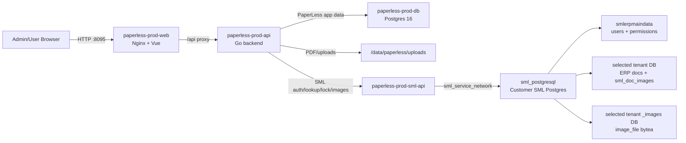

# Customer Deployment

## Target

- Customer URL: `http://45.122.49.250:8095`
- Stack path: `/data/paperless`
- Compose file: `/data/paperless/compose.yml`
- Production env file: `/data/paperless/config/.env.prod`
- Upload/PDF storage: `/data/paperless/uploads`
- Release evidence: `/data/paperless/releases/<timestamp>/`
- Preflight backup/snapshot: `/data/paperless/preflight-<timestamp>/`

The server has other projects. Keep PaperLess isolated and expose only the approved port.

The same release is also deployed for Wirat Home Mart at `http://43.240.113.44:8691`, using stack path `/data/paperless` and Compose project/container prefix `paperless-wirat`.

The same release is also deployed for Insee Construction at `http://45.122.49.253:8095`, using stack path `/data/paperless` and Compose project/container prefix `paperless-insee`.

The same release is also deployed for Damrong Homeplus at `http://45.122.49.252:8095`, using stack path `/data/paperless` and Compose project/container prefix `paperless-damrong`. This server hosts multiple unrelated customer projects (traefik, smlmcp, pickandpack, tms, accountupdater, pgadmin4) alongside a shared `sml_postgresql` instance serving many unrelated SML tenants; PaperLess containers and network are fully isolated under the `paperless-damrong-*` prefix and only port `8095` is published.

## Current Customer Status - 2026-08-11 (all four shops: SML source-hash false-positive fix, per-step drift check, Thai time display)

Root cause of a real production incident (PO `POIN66-5958` on Insee, blocked from SML image sync with status `sml_source_changed` despite zero real edits, confirmed via direct SML audit-trail inspection) traced to `sml-api-bybos`'s source-revision hash including unscaled `numeric` columns whose trailing-zero formatting can drift without any real value change. Fixed and rolled out to all four shops:

- `sml-api-bybos:9875c51` (was `b9088b4`) — normalizes every unscaled `numeric` column (header + detail rows, both `ic_trans`/`ic_trans_detail` and `ap_ar_trans`/`ap_ar_trans_detail`) to 2 decimal places before hashing. Verified against live production data (read-only/rolled-back transactions only) before rollout: a cosmetic numeric-format rewrite no longer flips the hash, while a genuine value edit still does, for both header and detail tables.
- `paperless-api`/`paperless-web:2a5cdca` (was `a56a52c`/`162e907`) — three additions:
  - Per-signer-step SML source re-verification (previously only checked at send and finalize, leaving long multi-signer gaps — the Insee incident had a 20-hour gap between two signers — completely unchecked). Fails **open** on SML transport errors/timeouts (does not block signing), fails **closed** only on a confirmed source-changed/source-missing result from SML.
  - Field-level diff now recorded in the audit/event metadata whenever a source mismatch is detected (which SML fields disagree, e.g. `doc_date`, `total_amount`), so a future incident like this one is diagnosable from the audit log alone.
  - New superadmin-only endpoint `POST /api/admin/sml/source-revisions/rebaseline` — re-baselines any still-in-flight (non-terminal-status) SML document's stored source revision against a live SML lookup. Necessary one-time step per shop after the `sml-api-bybos` hash-formula fix ships, since in-flight documents sent under the old formula would otherwise false-positive at their next finalize purely because the formula changed, not because SML data changed. Optimistically locked against concurrent send/finalize; documents already in a terminal attention state (e.g. `POIN66-5958`, already `sml_source_changed`) are excluded by the candidate filter, not specially special-cased.
  - Also pins frontend date/time display to `Asia/Bangkok` (`frontend/src/utils/signingFormatters.js`, consolidating 8 files that previously hand-rolled their own `Intl.DateTimeFormat` with no explicit timezone, silently following the viewer's browser timezone instead of matching SML's Bangkok-local timestamps).

Rollout order per shop: `sml-api` → `api`+`web` (same image tag `2a5cdca` for both) → rebaseline. All four shops completed same-session:

- **Pui**: `sml-api` deployed first standalone, then `api`+`web`. Rebaseline run via the new endpoint: 2 in-flight documents found and re-baselined (`PU17100009`, `PU26060003`), 0 skipped, 0 failed.
- **Wirat Home Mart**: all three images deployed together. Rebaseline candidate query run directly against the DB (no app-login credential available for this shop in this session) — 0 candidates (this shop currently has 0 `signing_documents` rows total).
- **Insee Construction**: all three images deployed together. Rebaseline candidate query run directly against the DB — 0 candidates; confirmed `POIN66-5958` (status `sml_source_changed`, a terminal state) is correctly excluded by the filter and was not touched.
- **Damrong Homeplus**: all three images deployed together. Rebaseline candidate query run directly against the DB — 0 candidates.
- Post-deploy smoke: HTTP 200 on each shop's public URL, all 4 containers (`sml-api`/`api`/`db`/`web`) healthy on every shop after recreation. `db` never recreated anywhere. Release evidence per shop under `/data/paperless/releases/<timestamp>-sml-source-fix-2a5cdca/postdeploy-checks.txt` (and a separate `<timestamp>-sml-hash-fix-9875c51` release folder on Pui for its standalone `sml-api` step).
- **Document `POIN66-5958` itself was intentionally left untouched** throughout, per explicit instruction — it remains in `sml_source_changed`, unresolved, pending a manual cancel/reimport by the customer or an operator.
- Not yet verified: full manual test pass (per-step drift detection catching a mismatch before finalize, Thai-time display across affected pages, fail-open behavior under a real SML outage) — customer/tester to verify directly.

## Current Customer Status - 2026-08-10 (all four shops: signer dropdown filter, web-only)

Frontend-only fix rolled out to all four shops: each signer-slot dropdown in Workflow configuration now excludes usernames already selected in the step's other slots, preventing duplicate-signer selection at the UI level (previously only caught by post-submit validation, which is still in place as a safety net).

- `paperless-web:162e907` deployed to all four shops. `api`, `db`, `sml-api` untouched everywhere (`api` remains `a56a52c`).
- Pui: was already on `web:f15b534` (max-signers-10 UI, deployed same day earlier) → `162e907`. Release evidence `/data/paperless/releases/20260810133730-signer-dropdown-filter-162e907/postdeploy-checks.txt`.
- Wirat Home Mart, Insee Construction, Damrong Homeplus: were still on `web:8066c5d` (predates the max-signers-10 frontend work) → `162e907`. This means these three shops received both the max-signers-10 UI and the dropdown-filter fix in one deployment. Release evidence under each shop's `/data/paperless/releases/<timestamp>-signer-dropdown-filter-162e907/postdeploy-checks.txt`.
- Post-deploy smoke: HTTP 200 on each shop's public URL after `web` container recreation; all `api`/`db`/`sml-api` containers remained healthy and untouched (verified via `docker compose ... ps` before/after on each server).
- **Not yet verified**: full manual UI checklist (open existing ≤3-signer Workflow, add signers 3→10, reopen a 10-signer step and confirm all 10 slots render, remove a middle signer and confirm compacting, create/sign a real SML and Internal document with >3 signers, verify PDF stamp positions) has only been run informally; awaiting customer/tester feedback from Pui before treating the other three shops' rollout as fully confirmed.

## Current Customer Status - 2026-08-08 (all four shops synced to latest)

All four production installations run the same image set as of this date:

- `paperless-api:a56a52c`, `paperless-web:8066c5d`, `sml-api-bybos:b9088b4`
- Pui: `db` untouched, release evidence `/data/paperless/releases/20260808212101-sync-latest/postdeploy-checks.txt`
- Wirat Home Mart: `db` untouched, release evidence `/data/paperless/releases/20260808142410-sync-latest/postdeploy-checks.txt`
- Insee Construction: `db` untouched, release evidence `/data/paperless/releases/20260808142531-sync-latest/postdeploy-checks.txt`
- Damrong Homeplus: already on this version from its own rollout (see the schema-repair and trial-expiry sections below)

Note when picking tags for a Web-only or API-only frontend/backend commit: GitHub Actions only builds the image whose path filter matched (`backend/**` vs `frontend/**`). A commit that only touches `frontend/` will NOT have a `paperless-api` image at that SHA — use the most recent commit SHA that actually touched `backend/` for the API tag. This caused one failed `pull` (`manifest unknown`) on the Pui shop during this rollout before the API tag was corrected.

All three re-synced shops (Pui, Wirat, Insee) keep their existing per-shop `.env.prod` / inline `environment:` config unchanged — this rollout only bumped image tags for `sml-api`, `api`, and `web`; no flags, `ALLOWED_TENANTS`, tenant defaults, or secrets were modified. `db` was never recreated on any shop.

### Known pitfall: `uploads` directory ownership (found and fixed on Damrong Homeplus, 2026-08-10)

The `paperless-api` image runs as a non-root user (`uid=100 gid=101`, named `app` inside the container). `/data/paperless/uploads` must be `chown`-ed to `100:100` on the host **before** the API container ever starts, or every PDF upload/write fails with `upload_write_failed` / `permission denied` even though the API container itself reports healthy (the healthcheck doesn't touch the upload path).

This was missed during Damrong Homeplus's initial `install -d` setup (created as `root:root`), which went unnoticed until a customer tried to upload a signature-template sample PDF two days after go-live. Fixed with:

```bash
chown -R 100:101 /data/paperless/uploads
```

Pui, Wirat Home Mart, and Insee Construction were checked after this was found — all three already had correct `100:101` ownership from their original setup. Verify this on any new shop's `uploads` (and any other bind-mounted, container-writable directory) as part of initial deploy, not just container health.

### Feature flag status across all four shops (verified 2026-08-08)

| Shop | `INTERNAL_DOCUMENTS_ENABLED` | `SML_SIGNATURE_SYNC_ENABLED` | `TRIAL_EXPIRES_AT` |
| --- | --- | --- | --- |
| Pui | `true` | `true` | not set |
| Wirat Home Mart | `true` | `true` | not set |
| Insee Construction | `true` | `true` | not set |
| Damrong Homeplus | `true` | `true` | `2026-10-08` |

## Trial Expiry Feature

`TRIAL_EXPIRES_AT` (optional, `YYYY-MM-DD`) blocks login after the given date (23:59:59 local) with `403 trial_expired` on both the SML and local-fallback login paths. Unset by default — installations without this var are completely unaffected. The value is echoed back in the login/`/me` response as `trialExpiresAt`; the frontend shows a non-dismissible warning banner (`AppTrialBanner.vue`, mounted in `AppLayout.vue`) once 3 days or fewer remain. Already-issued JWTs (max 12h TTL) keep working past expiry until they naturally expire — this only blocks new logins.

To extend or remove a trial: edit `TRIAL_EXPIRES_AT` in that customer's `config/.env.prod`, then `docker compose ... up -d --no-deps api` (no new image needed). Introduced in commit `b5b8be9`.

## Current Customer Status - 2026-08-08 (Damrong Homeplus) — trial expiry rollout

- Second deployment same day. PaperLess Web/API updated from `77b1eb1` to `b5b8be9` (adds the trial expiry feature above); SML API unchanged at `62c8acc`.
- Added `TRIAL_EXPIRES_AT=2026-10-08` to `config/.env.prod` — this customer is a 2-month trial starting 2026-08-08, per explicit customer request. Warning banner will appear in-app starting 2026-10-05.
- Only `api` and `web` were recreated (`--no-deps`); `db` and `sml-api` were left untouched to preserve the SML Postgres connection fixed during initial deploy (see pitfall note below).
- Release evidence: `/data/paperless/releases/20260808192659-trial-expiry-b5b8be9/postdeploy-checks.txt`
- Post-deploy smoke: `/health/live`, `/health/ready` HTTP 200; login endpoint reachable and returning normal auth errors (not `trial_expired`, confirming the trial gate correctly did not trigger before the expiry date).

## Current Customer Status - 2026-08-08 (Damrong Homeplus) — initial deployment

- Initial deployment. PaperLess Web/API release `77b1eb1`, SML API release `62c8acc`.
- Release evidence: `/data/paperless/releases/20260808184235-initial-77b1eb1/postdeploy-checks.txt`
- Default/admin tenant: `homeplus1` (Damrong Homeplus main branch, `branch_code 00000`, `branch_status 0`). `SML_IMAGE_TEMPLATE_DATABASE=homeplus1_images` — chosen because its `sml_doc_images` schema is more complete (includes `image_url` column and full column defaults) than the sibling branch `homeplus5_images`.
- `ALLOWED_TENANTS` scoped to the 19 real SML ERP tenants on this shared Postgres 11 server (`coffee,dcon,ddnt,drh,graphic,homeplus1,homeplus5,jamjan,jirapong,jka,mithtae,naratip,niphon,niphon_tax,taxdcon,taxjka,taxmithtae,virin,zxp`), excluding `smlerpmaindata` (auth DB itself), `control_center` and `wms_app` (unrelated non-SML applications on the same Postgres instance), and all `*_old`/`template0`/`template1`/`postgres` housekeeping databases.
- `INTERNAL_DOCUMENTS_ENABLED=true` and `SML_SIGNATURE_SYNC_ENABLED=true` were enabled from initial deploy (not a phased rollout like Insee's original baseline-off approach), per explicit customer instruction. SML API endpoints for company-profile and saved-signature sync were confirmed available before enabling.

Tenant readiness at initial deploy (`verify-sml-tenant --all-allowed --template homeplus1_images`):

- PASS (13): `drh`, `homeplus1`, `jamjan`, `jirapong`, `jka`, `mithtae`, `niphon`, `niphon_tax`, `taxdcon`, `taxjka`, `taxmithtae`, `virin`
- FAIL (6): `coffee`, `dcon`, `graphic` (image/main `sml_doc_images` columns do not match template), `ddnt` (missing `ddnt_images` database entirely), `homeplus5` (sibling branch, `sml_doc_images` schema missing `image_url` column and defaults), `naratip`, `zxp` (missing `_images` database)
- Failing tenants remain blocked at login until self-service "ตั้งค่า image DB" or admin `provision-sml-image-db` repairs their schema. `homeplus1` (the tenant this customer will actually use) passed every check.

Known deployment pitfall for this install: the pre-existing `sml_postgresql` container's `POSTGRES_PASSWORD` env var (`sml`) only works over the Docker `trust`-authenticated `local`/`127.0.0.1` paths in `pg_hba.conf`; real cross-container TCP connections require `md5` auth with the actual current password, which had been rotated and was not `sml`. Always confirm the SML Postgres password with the customer/SML team before assuming the container's env var reflects the live password.

## Current Customer Status - 2026-07-20

- PaperLess Web release: `20260720112943` (`c3acecb`) on both customer installations
- PaperLess API release retained: `d13867f`; it was not restarted by this Web-only deployment
- SML API release retained: `a51c7e9`; it was not restarted by this deployment
- Shared SML tenant readiness registry is enabled independently in each PaperLess database
- Post-deploy evidence: `/data/paperless/releases/20260720112943/postdeploy-checks.txt` on each server

Latest smoke results:

- Both public URLs, `/health/live`, and `/health/ready` returned HTTP 200 after deployment.
- Both installations run the same Web image digest `sha256:1ea21b709330d22a0c80a87283e611c5a3f81f9ee602e05815ad2f7db95289f8` built by GitHub Actions for `linux/amd64`.
- PaperLess API and DB were healthy; existing DB and SML API container IDs/restart counts were unchanged on both servers.
- Browser smoke confirmed the database batch-check button on desktop and 390px mobile with no horizontal overflow or console errors.
- The additive `sml_tenant_readiness_registry` migration and feature flag were verified on both installations.
- On the Pui installation, STPT moved from `unverified` to `ready`; a second login returned `source=registry`, and selected-database login issued a valid session without another full schema check.
- All 27 databases visible to the test account received their first registry result with no fatal/panic log entries. Non-ready databases remain blocked with their stored SML issue until a user retries after SML repair.
- The previous local Web image `d13867f` remains available for rollback. No source archive or Docker build cache was created on either customer server.

Known tenant readiness note: `PTTP-TAX` was still missing its main tenant DB during the latest login smoke and must remain blocked until SML/admin database setup is complete.

## Port Policy

PaperLess customer deployment uses host port `8095` for the web container.

Do not expose the backend, PaperLess Postgres, or SML API containers directly to the host unless an explicit maintenance window requires it.

## Service Layout

| Service | Purpose | Host Exposure |
|---|---|---|
| `paperless-prod-web` | Nginx + built Vue app + `/api` proxy | `8095` |
| `paperless-prod-api` | Go PaperLess API | Docker network only |
| `paperless-prod-db` | PaperLess application Postgres | Docker network only |
| `paperless-prod-sml-api` | SML bridge for auth, lookup, lock, image upload | Docker network only |
| `sml_postgresql` | Customer SML Postgres, existing container | Existing SML network |

## Data Flow


```mermaid
flowchart LR
  U["Admin/User Browser"] -->|HTTP :8095| W["paperless-prod-web\nNginx + Vue"]
  W -->|/api proxy| A["paperless-prod-api\nGo backend"]
  A -->|PaperLess app data| PDB["paperless-prod-db\nPostgres 16"]
  A -->|PDF/uploads| FS["/data/paperless/uploads"]
  A -->|SML auth/lookup/lock/images| SAPI["paperless-prod-sml-api"]
  SAPI -->|sml_service_network| SMLPG["sml_postgresql\nCustomer SML Postgres"]
  SMLPG --> AUTH["smlerpmaindata\nusers + permissions"]
  SMLPG --> ERP["selected tenant DB\nERP docs + sml_doc_images"]
  SMLPG --> IMG["selected tenant _images DB\nimage_file bytea"]
```

## Environment

Production values belong in `/data/paperless/config/.env.prod` and must not be committed.

Required groups:

- PaperLess Postgres connection and storage paths
- `JWT_SECRET`
- SML API key shared between PaperLess backend and SML API service
- `SML_PAPERLESS_BASE_URL`
- `SML_AUTH_PROVIDER`
- `SML_AUTH_DATAGROUP`
- `SML_IMAGE_TEMPLATE_DATABASE` ต้องชี้ไปยัง `_images` database มาตรฐานของลูกค้ารายนั้น เช่น `vrh_images` ห้ามใช้ค่าจากลูกค้ารายอื่น
- `SML_PAPERLESS_TENANT` default tenant
- `PAPERLESS_LOCAL_AUTH_FALLBACK_ENABLED`
- `PUBLIC_BASE_URL`
- Upload and template limits
- `INTERNAL_DOCUMENTS_ENABLED=true` after the additive migration and backend/frontend smoke checks pass

Provider and data group are system configuration values. The login UI must not ask the user to enter them.

## SML Tenant Image DB Preflight

Every selectable SML tenant must have a matching image database. For example, tenant `stpt` requires:

- `stpt` for ERP document data
- `stpt_images` for image bytes

Both databases must contain `public.sml_doc_images` with the same schema. Tenants created directly in PostgreSQL can miss the `_images` database, which causes PaperLess auto-finalization to stop at `completed_image_failed`.

กำหนด `SML_IMAGE_TEMPLATE_DATABASE` ใน production env ให้ตรงกับลูกค้าก่อนเริ่ม SML API แล้ว run จาก container ก่อนให้ลูกค้าทดสอบ:

```bash
docker exec <sml-api-container> ./verify-sml-tenant --all-allowed --template <template_images_db>
```

If a tenant image DB is missing, create only that image DB with dry-run first, then apply after customer approval:

```bash
docker exec <sml-api-container> ./provision-sml-image-db --tenant <tenant> --template <template_images_db>
docker exec <sml-api-container> ./provision-sml-image-db --tenant <tenant> --template <template_images_db> --apply
docker exec <sml-api-container> ./verify-sml-tenant --tenant <tenant> --template <template_images_db>
```

หน้าเลือก database มีปุ่ม `ตรวจสอบอีกครั้ง` สำหรับอ่าน readiness ล่าสุดหลังผู้ดูแลแก้ config/schema แล้ว ปุ่มนี้ไม่แก้ schema และไม่สร้าง database; การ provision ยังต้องผ่านสถานะที่ระบบรองรับและ approval ตาม runbook นี้

ผลตรวจจะแสดงทุกปัญหาที่พบพร้อมฐานข้อมูลและผู้รับผิดชอบ: ฐานหลัก/`_images` หาย, เปิดฐานไม่ได้หรือสงสัยฐานเสีย, ตารางหาย, columns/sequence/constraints/indexes ไม่ตรง, timeout, หรือระบบ template/readiness ไม่พร้อม ข้อความสำหรับผู้ใช้ต้องไม่แสดง PostgreSQL error ภายใน และต้องไม่แสดง `พร้อมใช้งาน` จน full verification ผ่านจริง

For day-to-day use, PaperLess also supports self-service image DB setup from the login page. If SML reports that a selected database is missing `<tenant>_images` or the `public.sml_doc_images` table is absent, the user can click `ตั้งค่า image DB`; PaperLess verifies the same SML username/password/database permission again, then creates only the missing image database/table through `paperless-prod-sml-api`. Main DB missing or existing schema mismatch cases remain blocked and require admin review.

Do not insert or repair `sml_doc_images` rows by direct SQL during normal operation. Use the PaperLess “ส่งรูป SML อีกครั้ง” retry action so events and lock flow remain auditable.

## Login Verification

Customer login must be verified with real SML credentials from `smlerpmaindata`.

Expected login behavior:

1. User enters SML username/password.
2. PaperLess asks the SML API for allowed databases and quick tenant readiness.
3. User selects a database every login.
4. If only the image DB is missing, user can click `ตั้งค่า image DB`; after success the same database becomes selectable.
5. PaperLess runs a full tenant readiness check before issuing the JWT.
6. PaperLess creates a local user if it does not exist yet.
7. SML `superadmin` maps to PaperLess `superadmin`; other SML users map to PaperLess `admin`. PaperLess-local users remain `user`.

## SML Saved Signature Rollout

The saved-signature feature reads `erp_user.signature_1` from the tenant selected in the JWT session. Enable `SML_SIGNATURE_SYNC_ENABLED=true` only after deploying the SML API endpoints for signature metadata and binary retrieval. Deployment order is SML API, PaperLess backend migration, frontend, then feature flag.

After deployment, sign in as superadmin, select the target database, open `/admin/users`, and run `Sync จาก SML`. Verify the preview summary before confirming. Test with one internal signer first: select `ลายเซ็นที่บันทึกไว้`, review the lazily loaded image, sign a new document, and verify the current/final PDF. Existing completed documents must retain their original signature file/version.

If sync reports a missing or invalid signature, PaperLess preserves the previous saved signature and records a warning. Set `SML_SIGNATURE_SYNC_ENABLED=false` for immediate rollback to draw-only signing; no schema rollback is required.

## Internal Document Rollout

Internal documents require SML API `GET /api/v1/company-profile`, the PaperLess additive migration, and the matching frontend. Deploy in this order: SML API, PaperLess API, PaperLess Web. Keep `INTERNAL_DOCUMENTS_ENABLED=false` until all three services are healthy, then enable it and recreate only the PaperLess API/Web services.

After enabling the flag, verify that the selected tenant has exactly one usable row in `public.erp_company_profile`. Open `Master เอกสารภายใน` as superadmin and confirm the three seeded Masters are inactive. Configure the Workflow, then use `จัดวางกรอบลายเซ็น` to place the required boxes in the blank approval area of the generated A4 template before activating a Master. Do not guess customer signers or activate a production Master with a test Workflow.

Safe smoke checks before customer configuration:

1. The Master list contains `PAYREQ`, `ADV`, and `PREPAY` as inactive.
2. The internal document create route opens and contains no PDF upload step.
3. An inactive or incomplete Master cannot create a document and returns a readable configuration error.
4. Existing SML document create, image upload, and lock flows remain unchanged.

After customer Workflow configuration, create one approved test document with no more than 15 rows, open the generated one-page PDF, edit it once to verify immutable revision behavior and automatic approval-cell placement, send it, and complete signing. Printing the latest revision is optional. Confirm logs contain no SML image or SML lock request for that internal document.

For immediate application rollback set `INTERNAL_DOCUMENTS_ENABLED=false` and restore the previous immutable API/Web image tags. Do not drop the additive tables or columns; existing internal records remain audit data and become visible again when the flag is re-enabled.

### Shared SML database readiness

Set `SML_TENANT_READINESS_REGISTRY_ENABLED=true` so each SML database receives one full schema verification per PaperLess installation. The result is tenant-wide and shared by all users who currently have SML permission for that database. PaperLess still authenticates the user and reloads database permissions from SML on every login.

`ready` results do not expire and are not checked by a periodic worker. A database is checked again only after a failed result is manually retried, a structural SML operation invalidates the stored result, or the application verification version changes. The migration is additive; set the flag to `false` to return to the previous live-check behavior without dropping the registry table.

For an operational recheck of a database that is already ready, a signed-in superadmin can call `POST /api/admin/sml/tenant-readiness/recheck`. The endpoint always uses the tenant in the current JWT session, applies the same advisory lock/cooldown as login checks, and records an audit event; it cannot be used to inspect an arbitrary tenant.

Development default credentials are not assumed to work on the customer server.

## Deploy Checklist

1. Confirm port `8095` is free or assigned to PaperLess.
2. Create/update `/data/paperless/config/.env.prod` with production secrets.
3. Pull or copy the release source/images.
4. Run `docker compose --env-file /data/paperless/config/.env.prod up -d`.
5. Confirm all PaperLess containers are healthy/running.
6. Open `http://45.122.49.250:8095`.
7. Test login with a real SML account.
8. Select the customer tenant database.
9. Run SML tenant image DB preflight for every allowed tenant.
10. Smoke test dashboard, workflow config, document search, PDF preview, signer queue, SML image upload, and SML lock.
11. If saved signatures are enabled, sync one known SML signature and verify explicit saved/drawn selection on a new internal task.

## Container Release Pipeline

PaperLess Web and API images are built by GitHub Actions, not on a developer computer or customer server.

- Web image: `ghcr.io/bosocmputer/paperless-web:<commit-sha>`
- API image: `ghcr.io/bosocmputer/paperless-api:<commit-sha>`
- Target platform: `linux/amd64`
- Release tags are immutable short Git commit SHAs. The `main` tag is informational and must not be used in production Compose.
- GitHub Actions must pass the frontend build or backend test suite before publishing its image.

Production deployment remains a controlled manual step. For each customer:

1. Save the current Compose file and container evidence under `/data/paperless/releases/<timestamp>/`.
2. Replace only the target service image with the immutable GHCR SHA tag.
3. Run `docker compose pull <service>`.
4. Run `docker compose up -d --no-deps <service>`.
5. Verify public URL, `/health/live`, `/health/ready`, container IDs, restart counts, and logs.
6. Keep the previous image and Compose snapshot for rollback.

Example for a Web-only release:

```bash
docker compose --env-file /data/paperless/config/.env.prod pull web
docker compose --env-file /data/paperless/config/.env.prod up -d --no-deps web
```

Do not run `docker build`, `docker system prune`, or a full-stack restart on customer servers. If a release fails, restore the saved Compose file and recreate only the affected service.

## Smoke Commands

From the customer server:

```bash
docker ps --filter "name=paperless-prod"
curl -fsS http://127.0.0.1:8095/
curl -fsS http://127.0.0.1:8095/health/live
curl -fsS http://127.0.0.1:8095/health/ready
```

Do not print secrets in terminal logs that will be copied into tickets or chat.

## Rollback

Keep each deploy timestamped under `/data/paperless/releases/<timestamp>/`.

Rollback should restore:

- Previous compose file
- Previous image tags
- Previous env file backup if changed
- PaperLess DB backup if a schema/data rollback is required
- Upload volume snapshot only if file storage changed incompatibly

Prefer image/compose rollback first. Only roll back database state when the release has written incompatible data and the business owner approves data loss/replay implications.

## Post-Deploy Evidence

Save a short deployment evidence file under `/data/paperless/releases/<timestamp>/postdeploy-checks.txt` with:

- Commit SHA or image tags
- Container names and status
- URL smoke result
- Login/database selection result
- One PDF preview result
- One SML auth/lookup result
- Any known limitation or customer credential blocker
